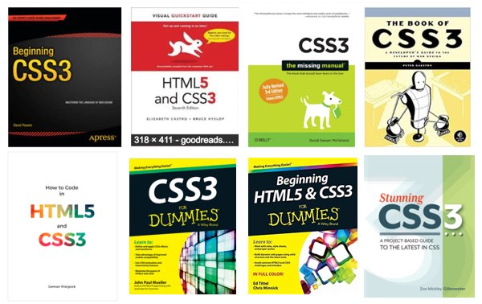
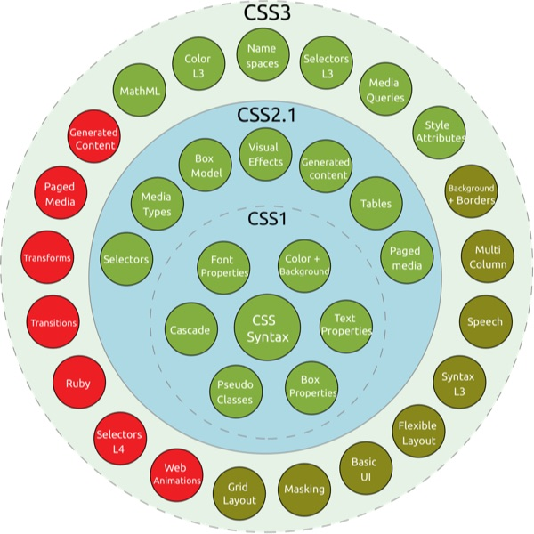
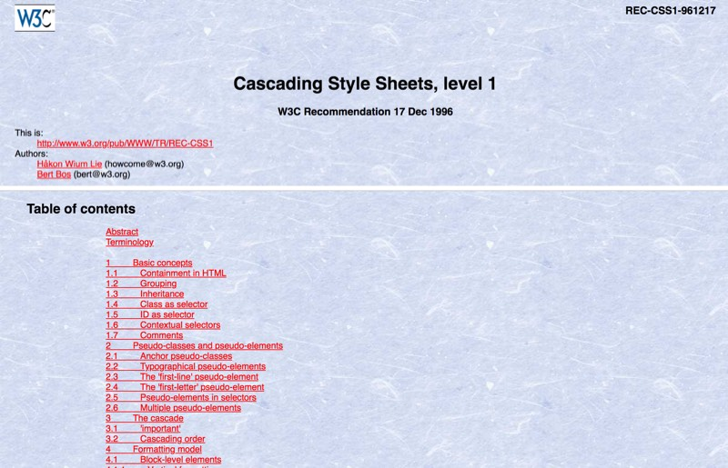

ตลอดช่วงเวลาที่ผ่านมาของโลก Frontend การมาถึงของ CSS ในเวอร์ชั่นที่สาม หรือ CSS3 ก็ทำให้พวกเราได้ตื่นเต้นกันสุด ๆ ด้วย Features ใหม่ ๆ ที่เพิ่มเข้ามาอย่างมากมาย มีหนังสือ, คอร์สเรียน และ Meetup เกี่ยวกับ CSS3 ผุดขึ้นเป็นดอกเห็ด มองไปทางไหน ๆ ก็เต็มไปด้วย CSS3

*...Mastering CSS3...*

*...CSS3 for DUMMIES...*

*...หลักสูตร Advance HTML5, CSS3...*

<p class="_tal-ct">
	<picture class="_mgt-32px">
		<source srcset="css3-book@2x.webp 2x, css3-book.webp" type="image/webp">
		<source srcset="css3-book@2x.jpg 2x, css3-book.jpg" type="image/jpeg">
		
		<em>ตัวอย่างหนังสือ ที่มีเนื้อหาเกี่ยวกับ CSS3</em>
	</picture>
</p>

CSS3 ได้กลายเป็นหนึ่งในสุดยอด Buzzword มาอย่างยาวนาน พูดได้ว่าใครเรียก CSS ว่า CSS เฉย ๆ นี่เชยตายเลยครับ

ตั้งแต่ CSS3 ได้ปรากฏตัวให้พวกเราได้ใช้งานในช่วงแรก ๆ ประมาณปี 2011 ก็ได้มีการพัฒนาความสามารถต่าง ๆ เพิ่มขึ้นมาอย่างต่อเนื่อง โดย Feature ล่าสุด ที่คนต่างพูดถึงคือ สิ่งมาที่เปลี่ยนโลกการทำ Layout อย่าง Grid Layout

เวลาก็ผ่านมาหลายปีแล้ว แต่ก็ยังไร้วี่แววของ Buzzword อย่าง... **“CSS4”**

## CSS4 มาหรือยัง หรือตอนนี้เราใช้ CSS4 กันอยู่แล้ว ?

ไม่ครับ เราไม่ได้ใช้ CSS4 กันอยู่ แล้วก็จะไม่มี CSS4 ด้วย!?

จริง ๆ ต้องบอกว่า CSS3 เอง ก็ไม่มีอยู่จริงครับ

> *“แต่เรามี CSS1, CSS2 (มี CSS2.1 กับ CSS2.2 ด้วย) และ CSS3 นะ จะไม่มี CSS4 ได้ยังไง ?”*

ก่อนอื่นเรามาดูกันก่อนครับ ว่า CSS แต่ละเวอร์ชั่น คืออะไร ?

## CSS Level

CSS (Cascading Style Sheets) จะไม่ได้ใช้ระบบ Versions เหมือนที่อื่น ๆ แต่จะใช้สิ่งที่เรียกว่า **Levels** ในการบอกถึงระดับในการพัฒนา เช่น CSS Level 1 ก็เรียกสั้น ๆ ว่า CSS1 นั่นเองครับ

แต่ละ Level ของ CSS จะถูกสร้างขึ้นต่อจาก Level ด้านล่าง โดยจะมีการปรับปรุง และเพิ่ม Features ใหม่ ๆ เข้าไป กล่าวได้ว่า CSS2 คือการเอา CSS1 มาเพิ่มความสามารถครับ

<p class="_tal-ct">
	<picture class="_mgt-32px">
		<source srcset="css-level@2x.webp 2x, css-level.webp" type="image/webp">
		<source srcset="css-level@2x.jpg 2x, css-level.jpg" type="image/jpeg">
		
		<em>CSS Level – ภาพจาก wikipedia</em>
	</picture>
</p>

### CSS level 1

<a href="https://www.w3.org/Style/CSS/members" target="_blank" rel="noreferrer noopener" class="bio-link -fancy">CSSWG (CSS Working Group)</a> หรือกลุ่มคน ที่เป็นผู้ออกแบบ CSS ได้ร่างเอกสาร Specification ของ CSS Level 1 ออกมาตั้งแต่ปี 1996 ก่อนที่จะค่อย ๆ ถูก Implement ใน Web Browser ให้เราใช้งานในภายหลัง

ตัวเอกสารจะระบุถึง Features ทุกอย่างของ CSS level 1 เอาไว้ ไม่ว่าจะเป็นเรื่องของ ```margin```, ```padding```, ```font``` หรือ ```border``` เป็นต้น เป็นเอกสารที่ค่อนข้างยาว และละเอียดมากทีเดียว เพราะต้องลงรายละเอียดของทุก ๆ Features ให้เป็น Specification ฉบับเดียวกัน เพื่อให้ Vendor นำไปใส่ใน Web Browser กันต่อไป

<p class="_tal-ct">
	<picture class="_mgt-32px">
		<source srcset="css1@2x.webp 2x, css1.webp" type="image/webp">
		<source srcset="css1@2x.jpg 2x, css1.jpg" type="image/jpeg">
		
		<em>เอกสาร CSS Level 1</em>
	</picture>
</p>

เพื่อน ๆ สามารถเข้าไปดูเอกสาร CSS Level 1 ที่เป็นรูปแบบดั้งเดิมได้ที่ <a href="https://www.w3.org/TR/REC-CSS1-961217" target="_blank" rel="noreferrer noopener" class="bio-link -fancy">Website</a> ของ W3C ครับ

### Maturity Level

แน่นอนว่าไม่ใช้แค่ทำเอกสารเสร็จ แล้วจะสามารถนำไป Implement ใน Web browser ได้เลย แต่เอกสารนี้ จะต้องผ่านกระบวนการต่าง ๆ อีกมากมาย

ซึ่งแบ่งเป็นสถานะที่เรียกว่า Maturity Level ดังนี้

- **Working Draft (WD)** – คือ Level ของเอกสารที่ยังไม่ Stable แต่ทำออกมาเพื่อให้ Community และ สมาชิก W3C ได้ทำการรีวิว เมื่อรีวิวเรียบร้อย หรือไม่มีการเปลี่ยนแปลงใด ๆ แล้ว อย่างน้อย 6 เดือน ก็จะเข้า Level ถัดไป
- **Candidate Recommendation (CR)** – คือ Level ที่ CSSWG พึงพอใจ และแก้ Issues ต่าง ๆ หมดแล้ว และได้รับการยอมรับจาก Community ก็จะเป็นการประกาศ เพื่อให้ผู้ที่ Implement ทำการตรวจสอบว่า Requirement ชัดเจนเพียงพอหรือยัง
- **Proposed Recommendation (PR)** – เมื่อ Director ของ W3C ทำการรับรอง ว่าเอกสารมีคุณภาพเพียงพอ ก็จะเข้าสู่ Level PR เตรียม Propose ให้เป็น W3C Recommendation ต่อไป
- **W3C Recommendation (REC)** – คือ Level หลังจากผ่านการรับรองขั้นสุดท้าย จากเหล่าคณะกรรมการแล้ว ก็จะถือว่า Specification ใช้เป็น Standard ได้

ซึ่งกระบวนการเหล่านี้ จะกินเวลานานมาก และมีกระบวนการตีกลับให้ไปแก้ไข ซึ่งผมไม่ได้พูดถึงอีกด้วย

เพื่อน ๆ อาจจะเคยได้ใช้งาน Vendor prefix ของ CSS เช่น ```-webkit-```, ```-moz-``` หรือ ```-ms-``` กันใช่ไหมครับ

Prefix เหล่านี้ Vendor ได้นำมาใช้งาน เพื่อเป็นการทดสอบ Features ของ CSS โดยไม่กระทบกับ Standard ก่อนที่มันจะมี Maturity Level ที่สูงพอ

บางครั้งก็อาจมีการ Implement บางส่วนของ Specification มาให้เราใช้งานก่อน ตั้งแต่ยังมี Level เป็น CR ก็มีครับ

หรือบางทีก็แย่มากถึงขนาดที่ใส่ Feature ที่ไม่มีอยู่แม้แต่ใน Draft ด้วยซ้ำ (-webkit- นี่แหละตัวดีเลย)

### CSS level 2 / 2.1 / 2.2

CSS Level 2 ก็คือการเอา Specification ของ CSS Level 1 มาปรับปรุง และเพิ่ม Features ใหม่ ๆ เข้าไป อย่างเช่น ```border-radius``` เป็นต้น

โดยจะทำการร่างเอกสาร Specification ใหม่ทั้งหมด Feature ที่ไม่มีอะไรเปลี่ยนแปลง ก็ต้องถูกเอาไปใส่ใน Specification ด้วย ถึงจะเป็น Specification ที่สมบูรณ์ได้

และเอา Specification ทั้งหมดนี้ ไปเข้ากระบวนการพิจารณาใหม่ ตั้งแต่ต้น...

ซึ่งมันช้า และวุ่นวายมาก ๆ แม้จะเป็นการแก้ไขเพียงเล็กน้อยก็ตาม

### CSS level 3

จากปัญหาเรื่องความล่าช้า ของกระบวนการต่าง ๆ เพราะ Specification มีลักษณะเป็น Monolithic คือรวมทุกอย่าง เป็นเอกสารชุดเดียว

CSSWG จึงได้ทำการ แตก Specification ออกเป็น Module เช่น CSS Color Module Level 3, CSS Background and Border Module Level 3 เป็นต้น

และเมื่อมี Module ใหม่ ๆ เข้ามา ก็จะไปเริ่มที่ Level 1 ใหม่ เช่น CSS Flexible Box Layout Level 1 เป็นต้น

ด้วยการเปลี่ยนแปลงนี้ ทำให้ กระบวนการต่าง ๆ มีความรวดเร็วขึ้น เพราะไม่จำเป็นต้องรอให้ Specification ของทุกอย่างเรียบร้อย แต่พิจารณาแยกเป็นแต่ละ Module ได้เลย

ทำให้ในช่วงเวลานั้น CSS มี Feature ใหม่ ๆ เกิดขึ้นมามากมาย จนเกิดเป็น Buzzword “CSS3” ขึ้นมา ทั้ง ๆ ที่ไม่มีแม้แต่ CSS Level 3 Specification ด้วยซ้ำ

### สุดท้าย

เพื่อน ๆ สามารถดู <a href="https://www.w3.org/Style/CSS/current-work" target="_blank" rel="noreferrer noopener" class="bio-link -fancy">สถานะปัจจุบัน</a> ของแต่ละ Module ได้ครับ ว่าจะมีอะไรใหม่ ๆ มาให้เราได้ใช้บ้าง และ Module ไหน มี Maturity Level ใดบ้างแล้ว

CSS นั้นมีการพัฒนาอยู่ตลอด โดย CSSWG, เหล่า Vendor และ Community ทำให้ CSS เป็นหนึ่งในเครื่องมือสร้าง User Interface ที่ทรงพลัง มาอย่างเนิ่นนาน
