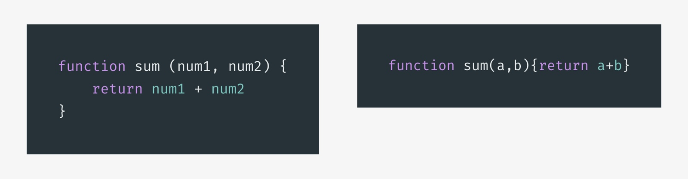

ในปัจจุบัน Performance หรือความเร็ว มีความสำคัญมาก ๆ และส่งผลกระทบต่อโดยตรง ต่อประสบการณ์การใช้งานของผู้ใช้ และ Ranking ของ Google search

มีกรณีศึกษาจากเว็บดัง ๆ มากมาย ที่พูดถึงความสัมพันธ์ของความเร็วในการโหลดเว็บ กับผลกระทบที่เกิดขึ้น

- **Amazon** – ทุก 0.1 วินาที ที่โหลดช้าลง ส่งผลให้ยอดขายลดลง 1% ซึ่งคิดเป็นมูลค่า 1.3 พันล้าน USD ต่อปี
- **Walmart** – ทุก 1 วินาที ที่โหลดเร็วขึ้น ส่งผลให้ Conversion Rate เพิ่มขึ้น 2% ซึ่งคิดเป็นมูลค่า 274 ล้าน USD ต่อปี
- **Yahoo** – ทุก 0.4 วินาที ที่โหลดเร็วขึ้น ส่งผลให้ Traffic เพิ่มขึ้น 9% ซึ่งคิดเป็น 600 ล้านผู้ใช้งาน ต่อปี

โอ้โห ถ้าความเร็ว ส่งผลขนาดนี้แล้วละก็ เราก็คงปล่อยให้เว็บ เราช้ากว่าคู่แข่งไม่ได้แล้วล่ะครับ 😅

## Optimize เว็บอย่างไรดี ?

การทำให้เว็บเร็วขึ้น มีอยู่สองแบบ คือ Optimize **Objective time** (เวลาที่วัดผลเป็นตัวเลขได้) หรือ **Subjective time** (เวลาที่มนุษย์รับรู้, ความรู้สึก)

ในบทความนี้ ผมจะพูดถึงเทคนิคการ Optimize Objective time เป็นหลัก เนื่องจากวัดผลได้ง่ายกว่า และ Frontend Developer สามารถทำได้เองโดยง่าย

เครื่องมือวัดผลแบบฟรี ที่แนะนำก็จะมี

- <a href="https://developers.google.com/web/tools/lighthouse/" target="_blank" class="bio-link -fancy" rel="noopener">**Lighthouse**</a>
- <a href="https://gtmetrix.com" target="_blank" class="bio-link -fancy" rel="noopener">**GTMetrix**</a>

โดยส่วนตัวผมค่อนข้างชอบ GTMetrix มากกว่า เนื่องจากค่อนข้างเจาะลึกในรายละเอียดมากกว่า

เรามาดูกันว่า Frontend Developer ควรทำอะไรบ้างเพื่อให้เว็บเราเร็วขึ้นครับ

### 1.) Minify HTML, CSS, JS

การ Minify ทำได้ง่ายและควรทำ เรียกได้ว่าถ้าไม่นี่บาปเลย โดยเป้าหมายของการ Minify ก็คือการลดขนาด Resource ลง ส่งผลให้โหลด Resource นั้นเร็วขึ้น

กระบวนการ Minify จะทำการตัด Characters ที่ไม่จำเป็นออก เช่น Space หรือ Newline และถ้าตรวจสอบดูแล้วว่าปลอดภัย Minifier ก็จะทำการเปลี่ยนชื่อตัวแปลให้สั้นลงด้วย โดยที่ทุกอย่าง ยังทำงานเหมือนเดิม

	<picture class="_mgt-32px">
		<!-- <source srcset="rgb-addition@2x.webp 2x, rgb-addition.webp 1x" type="image/webp"> -->
		<!-- <source srcset="rgb-addition@2x.jpg 2x, rgb-addition.jpg 1x" type="image/jpeg"> -->
		<!--  -->
		
		<em>ตัวอย่าง javascript ก่อน Minify (ซ้าย), หลัง Minify (ขวา)</em>
	</picture>

การ Minify สามารถทำได้ง่าย โดยใช้ Plugin ของ Task runner, Bundler เช่น <a href="https://webpack.js.org/" target="_blank" class="bio-link -fancy" rel="noopener">Webpack</a>, <a href="https://gulpjs.com/" target="_blank" class="bio-link -fancy" rel="noopener">Gulp</a>, <a href="https://gruntjs.com/" target="_blank" class="bio-link -fancy" rel="noopener">Grunt</a> หรือ <a href="http://browserify.org/" target="_blank" class="bio-link -fancy" rel="noopener">Browserify</a> โดยกรณีของผม คือทำการ Optimize Blog นี้ ผมเลือกใช้ Gulp เพราะใช้งานง่าย และตรงความต้องการของผมที่สุดครับ

Plugin ที่แนะนำคือ

- <a href="https://github.com/hustxiaoc/gulp-minify" target="_blank" class="bio-link -fancy" rel="noopener">gulp-minify</a>
- <a href="https://github.com/terinjokes/gulp-uglify" target="_blank" class="bio-link -fancy" rel="noopener">gulp-uglify</a>

## 2.) Optimize image

เป้าหมายของการ Optimize image คือทำรูปให้มีขนาดเล็กลง แต่คุณภาพของรูปเท่าเดิม หรือลดลงในระดับที่เหมาะสม สิ่งที่ Frontend Developer ควรคำนึงมีดังต่อไปนี้

### เลือก file type ให้เหมาะสมกับรูปภาพ

- **jpeg** – เป็น Lossy Compression เหมาะกับการแสดงผล รูปถ่าย สามารถลดคุณภาพการบีบอัด เพื่อให้ได้ขนาดไฟล์ที่ต้องการ
- **png** – เป็น Lossless Compression ไม่มีการบีบอัดใด ๆ สามารถแสดงผล transparency ได้ เหมาะกับการแสดงภาพที่มีตัวหนังสือ, Screenshot, ภาพที่มีส่วนโปร่งใส หรือ ภาพที่ต้องการ Pixel Perfect
- **svg** – เป็น Vector graphic ขนาดเล็กแต่สามารถขยายขนาดได้ไม่จำกัด โดยไม่เสียรายละเอียด เพมาะกับการแสดง

## 3.) ลดความซับซ้อนของ DOM

## 4.) ตัด CSS ที่ไม่ได้ใช้ออก
เชื่อมะว่ามีเยอะมาก
CSSOM

## 5.) Inline Critical CSS

## 6.) Gzip

## 7.) dns prefetch, preload

## 8.) cdn

## 9.) Defer js

## 10 Cache เหมาะสม