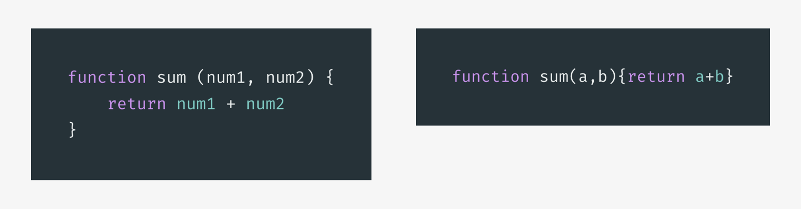
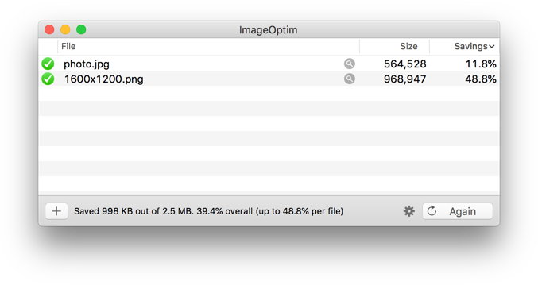
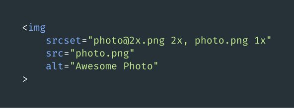
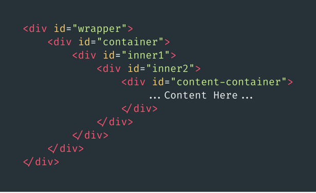
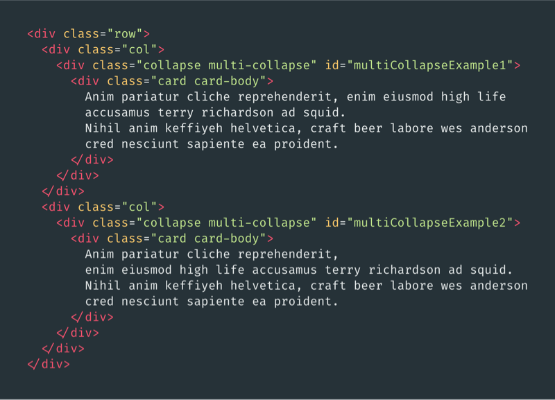
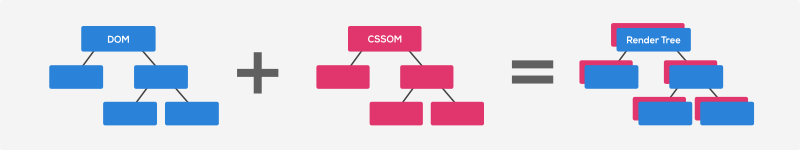
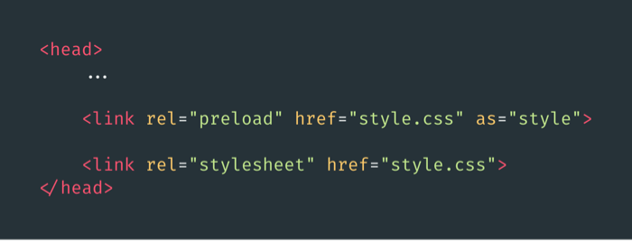
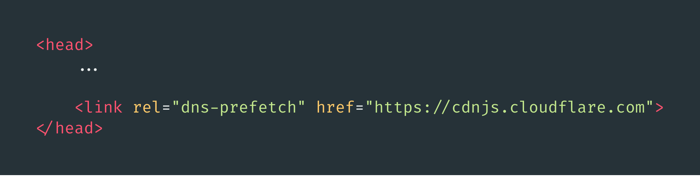

ในปัจจุบัน Performance หรือความเร็ว มีความสำคัญมาก ๆ และส่งผลกระทบต่อโดยตรง ต่อประสบการณ์การใช้งานของผู้ใช้ และ Ranking ของ Google search

มีกรณีศึกษาจากเว็บดัง ๆ มากมาย ที่พูดถึงความสัมพันธ์ของความเร็ว กับผลกระทบที่เกิดขึ้น

- **Amazon** – ทุก 0.1 วินาที ที่โหลดช้าลง ส่งผลให้ยอดขายลดลง 1% ซึ่งคิดเป็นมูลค่า 1.3 พันล้าน USD ต่อปี
- **Walmart** – ทุก 1 วินาที ที่โหลดเร็วขึ้น ส่งผลให้ Conversion Rate เพิ่มขึ้น 2% ซึ่งคิดเป็นมูลค่า 274 ล้าน USD ต่อปี
- **Yahoo** – ทุก 0.4 วินาที ที่โหลดเร็วขึ้น ส่งผลให้ Traffic เพิ่มขึ้น 9% ซึ่งคิดเป็น 600 ล้านผู้ใช้งาน ต่อปี

โอ้โห ถ้าความเร็ว ส่งผลขนาดนี้ เราก็คงปล่อยให้เว็บเรา ช้ากว่าคู่แข่งไม่ได้แล้วล่ะครับ 😅

## Optimize เว็บอย่างไรดี ?

การทำให้เว็บเร็วขึ้น มีอยู่สองแบบ คือ Optimize **Objective time** (เวลาที่วัดผลเป็นตัวเลขได้) หรือ **Subjective time** (เวลาที่มนุษย์รับรู้, ความรู้สึก)

บทความนี้ จะเป็นมุมมองของ Frontend Developer ผมจึงจะพูดถึงเทคนิคการ Optimize Objective time เป็นหลัก เนื่องจากวัดผลได้ง่ายกว่า

เครื่องมือวัดผลแบบฟรี ที่แนะนำก็จะมี

- <a href="https://developers.google.com/web/tools/lighthouse/" target="_blank" class="bio-link -fancy" rel="noopener">Lighthouse</a>
- <a href="https://gtmetrix.com" target="_blank" class="bio-link -fancy" rel="noopener">GTMetrix</a>

ผมค่อนข้างชอบ GTMetrix มากกว่า เนื่องจากคเจาะลึกในรายละเอียดมากกว่าครับ

เรามาดูกันว่า Frontend Developer ควรทำอะไรบ้างเพื่อให้เว็บเราเร็วขึ้นครับ

### 1.) Minify HTML, CSS, JS

การ Minify ทำได้ง่ายและควรทำ เรียกได้ว่าถ้าไม่นี่พลาดมาก โดยเป้าหมายของการ Minify ก็คือการลดขนาด Resource ลง ส่งผลให้โหลด Resource นั้นเร็วขึ้น

กระบวนการ Minify จะทำการตัด Characters ที่ไม่จำเป็นออก เช่น Space หรือ Newline และถ้าตรวจสอบดูแล้วว่าปลอดภัย Minifier ก็จะทำการเปลี่ยนชื่อตัวแปลให้สั้นลงด้วย โดยที่ทุกอย่าง ยังทำงานเหมือนเดิม

<p class="_tal-ct">
	<picture class="_mgt-32px">
		<!-- <source srcset="minify@2x.webp 2x, minify.webp 1x" type="image/webp"> -->
		<!-- <source srcset="minify@2x.png 2x, minify.png 1x" type="image/jpeg"> -->
		
		<em>ตัวอย่าง javascript ก่อน Minify (ซ้าย), หลัง Minify (ขวา)</em>
	</picture>
</p>

การ Minify สามารถทำได้ง่าย โดยใช้ Plugin ของ Task runner, Bundler เช่น <a href="https://webpack.js.org/" target="_blank" class="bio-link -fancy" rel="noopener">Webpack</a>, <a href="https://gulpjs.com/" target="_blank" class="bio-link -fancy" rel="noopener">Gulp</a>, <a href="https://gruntjs.com/" target="_blank" class="bio-link -fancy" rel="noopener">Grunt</a> หรือ <a href="http://browserify.org/" target="_blank" class="bio-link -fancy" rel="noopener">Browserify</a> โดยกรณีของผม คือทำการ Optimize Blog นี้ ผมจึงเลือกใช้ Gulp เพราะใช้งานง่าย และตรงความต้องการที่สุดครับ

Plugin ที่แนะนำคือ

- <a href="https://github.com/hustxiaoc/gulp-minify" target="_blank" class="bio-link -fancy" rel="noopener">gulp-minify</a>
- <a href="https://github.com/terinjokes/gulp-uglify" target="_blank" class="bio-link -fancy" rel="noopener">gulp-uglify</a>

## 2.) Optimize image

เป้าหมายของการ Optimize image คือทำรูปให้มีขนาดเล็กลง แต่คุณภาพของรูปเท่าเดิม หรือลดลงในระดับที่เหมาะสม สิ่งที่ Frontend Developer ควรคำนึงมีดังต่อไปนี้

### เลือก File type ให้เหมาะสมกับประเภทของภาพ

File type ทั่วไปที่ถูกใช้งานบ่อยคือ

- **JPG** – เป็น Lossy Compression เหมาะกับการแสดงผล รูปถ่าย เพราะสามารถบีบอัด ลดคุณภาพลง เพื่อให้ได้ขนาดไฟล์ที่ต้องการ
- **PNG** – เป็น Lossless Compression ไม่มีการบีบอัดใด ๆ สามารถแสดงผล transparency ได้ เหมาะกับการแสดงภาพที่มีตัวหนังสือ, Screenshot, ภาพที่มีส่วนโปร่งใส หรือ ภาพที่ต้องการ Pixel Perfect
- **SVG** – เป็น Vector graphic ขนาดเล็กแต่สามารถขยายได้ไม่จำกัด โดยไม่เสียรายละเอียด เหมาะกับการแสดงภาพ Icon, Symbol หรือ Vector animation (เล็กกว่า gif หลายเท่าตัวเลย)

### ตัดข้อมูลที่ไม่จำเป็นต่อการแสดงผลออก

ในรูปภาพ จะมีข้อมูล Metadata ที่ไม่จำเป็นต่อการแสดงผล เช่น EXIF, Color profile, GPS, Gramma ซึ่งส่วนใหญ่เราไม่มีความจำเป็นที่ต้องใช้ เว้นแต่ในบางกรณี เช่นเรื่องของ Copyright เป็นต้น

สำหรับ MacOS เครื่องมือที่ผมใช้คือ <a href="https://imageoptim.com/mac" target="_blank" class="bio-link -fancy" rel="noopener">ImageOptim</a> ที่ใช้งานได้ง่ายแค่ Drag and Drop โปรแกรมก็จะทำการลดขนาดไฟล์ให้เราทันที โดยไม่ลดคุณภาพ แต่ก็สามารถตั้งค่าให้ลดคุณภาพ ให้ขนาดเล็กลงอีกได้

<p class="_tal-ct">
	<picture class="_mgt-32px">
		<!-- <source srcset="imageOptim@2x.webp 2x, imageOptim.webp 1x" type="image/webp"> -->
		<source srcset="imageOptim@2x.jpg 2x, imageOptim.jpg 1x" type="image/jpeg">
		
		<em>ตัวอย่างการลดขนาดรูปด้วย ImageIptim</em>
	</picture>
</p>

### หลีกเลี่ยงการโหลดรูปขนาดใหญ่กว่าที่ใช้จริง

การส่งรูปที่ใหญ่กว่าที่ใช้งานจริง นอกจากที่จะโหลดช้าโดยไม่จำเป็นแล้ว ยังเปลือง Bandwidth อีกด้วย

โดยสาเหตุที่ผมเจอส่วนใหญ่ ก็มักจะมาจากเรื่องการแสดงผลบนจอ HiDPI เช่น Retina screen เลยส่งไฟล์ใหญ่สุดมาโดยไม่ Fallback สำหรับจอปรกติ ภาพจะได้คมชัด ลองคิดดูว่าถ้า มือถือต้องโหลดภาพที่ใช้กับจอ Retina มาแสดงผลนี่ เปลือง data มาก ๆ 😢

อีกส่วนคือมาจากการออกแบบที่ไม่ดีพอ แยกความต่างของ Image และ Background Image ไม่ออก ทำให้จำเป็นต้องใช้รูปขนาดใหญ่กว่าที่จำเป็น

การทำ Responsive Image สามารถทำได้ง่ายด้วย attribute ```srcset``` ของ `````` โดยที่เราสามารถกำหนดเงื่อนไข การเลือกใช้งานภาพใด ๆ ได้ทั้งแบบตาม Media query หรือ ตาม Resolution (1x, 2x)

<p class="_tal-ct">
	<picture class="_mgt-32px">
		<!-- <source srcset="srcset@2x.webp 2x, srcset.webp 1x" type="image/webp"> -->
		<source srcset="srcset@2x.png 2x, srcset.png 1x" type="image/jpeg">
		
		<em>การใช้งาน srcset เพื่อโหลด ภาพ photo@2x.png เมื่อ device pixels มีขนาดเป็น 2 เท่าของ CSS pixels</em>
	</picture>
</p>

HTML นี้จะเป็นการบอก Browser ว่า

- ถ้า device pixels มีขนาดเป็น 2 เท่า (2x) ของ CSS pixels ให้ใช้ภาพ photo@2x.png แทน src ของ img นี้ (จอ Retina เป็นต้น)
- แต่ถ้ามี pixels เท่ากัน (1x) ให้ใช้ photo.png (จอภาพทั่วไป)
- แต่ถ้าไม่เข้าเงื่อนไข หรือไม่รู้จัก ```srcset``` ก็ใช้ภาพใน ```src``` ตามเดิม (fallback)

จริง ๆ แล้วเรื่องการ Optimize Image นั้นยังมีเรื่องที่น่าสนใจอีกเยอะมาก เช่นการใช้ File type สมัยใหม่ เช่น WebP, JPEG2000 และการใช้ ```<picture>``` เอาไว้ผมจะมาเล่นให้ฟังในบทความต่อ ๆ ไปครับ

## 3.) ลดความซับซ้อนของ DOM

เคยเห็น HTML ที่มี ```<div>``` ซ้อน ```<div>``` ซ้อน ```<div>``` ... ไหมครับ ยิ่งเรา Nested HTML Tag ที่ไม่จำเป็นมากเท่าไร ก็ยิ่งมี node ที่ไม่จำเป็นมากขึ้น และ DOM Tree ของเราก็จะซับซ้อน ทำให้ Browser ก็ใช้เวลามากขึ้นในการ Render

นอกจาก Browser แล้ว ก็ยังทำให้ Developer ด้วยกันเองนี่แหละครับ อ่าน Code ยากไปอีก

<p class="_tal-ct">
	<picture class="_mgt-32px">
		<!-- <source srcset="divitis@2x.webp 2x, divitis.webp 1x" type="image/webp"> -->
		<source srcset="divitis@2x.png 2x, divitis.png 1x" type="image/jpeg">
		
		<em>การที่มี div มากเกินความจำเป็น (Divitis)</em>
	</picture>
</p>

ผมคิดว่าสาเหตุมาจากสองเรื่องใหญ่ ๆ คือ

1. **ในอดีตการทำ Layout มีความยาก** – ในยุคก่อน ๆ Layout บางรูปแบบ ทำยากมาก และยังต้องรองรับ Responsive อีกด้วย การใส่ container ที่ไม่จำเป็นจึงเกิดขึ้นมาเพื่อ hack ให้ได้ layout ที่ต้องการ แต่ในปัจจุบัน หลังจากที่มี Flexbox และ CSS Grid การ hack เหล่านั้น ก็ไม่จำเป็นอีกต่อไปแล้ว

2. **CSS Framework สร้างมาตรฐานที่ไม่ดีเอาไว้** – ใครที่เคยเข้าไป Copy snippet code ของ CSS framework ชื่อดังบางตัว คงจะคุ้นตากับ Markup ที่มี div ซ้อนกันเยอะมาก ๆ ใช่ไหมครับ (ไม่รู้ว่าปัจจุบัน ดีขึ้นหรือยัง)

<p class="_tal-ct">
	<picture class="_mgt-32px">
		<!-- <source srcset="bootstrap@2x.webp 2x, bootstrap.webp 1x" type="image/webp"> -->
		<source srcset="bootstrap@2x.png 2x, bootstrap.png 1x" type="image/jpeg">
		
		<em>snippet code ของ bootstrap (นี่ขนาดยังไม่ได้ใส่ Responsive container เข้าไปนะนี่)</em>
	</picture>
</p>

การเขียน HTML สมัยใหม่จึงควร ลด ละ เลิก การเขียน ที่มีความซับซ้อนโดยไม่จำเป็นครับ

## 4.) CSSOM ก็เรื่องที่ไม่ควรมองข้าม

การใส่ class ที่ไม่ได้ใช้งานมาใน CSS ไม่เพียงแต่จะทำให้ขนาดไฟล์ ใหญ่เกินความจำเป็น แต่ class เหล่านั้น ยังต้องถูกนำมาสร้างเป็น CSSOM (CSS Object Model) ด้วย ถึงแม้ใน Document เราจะไม่ได้ใช้งาน class เหล่านั้นก็ตาม 😱

แม้ว่าเราจะ cache CSS ไฟล์ได้ แต่ CSSOM จะไม่ถูก cache ไปด้วย และ Web browser จะสร้าง CSSOM ขึ้นมาใหม่ทุกครั้งที่เราโหลดหน้า

CSSOM จะถูกนำมารวมกับ DOM เพื่อใช้สร้าง Render Tree ในตอนหลัง จึงทำให้ทั้ง HTML (ใช้สร้าง DOM) และ CSS (ใช้สร้าง CSSOM) เป็น Resource ที่ Render Blocking

<p class="_tal-ct">
	<picture class="_mgt-32px">
		<!-- <source srcset="render-tree@2x.webp 2x, render-tree.webp 1x" type="image/webp"> -->
		<source srcset="render-tree@2x.png 2x, render-tree.png 1x" type="image/jpeg">
		
		<em>DOM, CSSOM และ Render Tree</em>
	</picture>
</p>

การลบ class ที่ไม่ได้ใช้งานออกไป เราสามารถใช้เครื่องมือ อย่าง เช่น <a href="https://www.purgecss.com/" target="_blank" class="bio-link -fancy" rel="noopener">PurgeCSS</a> เพื่อ Automate จัดการให้เราได้ ซึ่งก็มีเป็น Plugin ใช้ได้กับทุก Task runner หรือ Bundler tool เลยครับ สะดวกมาก

ซึ่งผมรับประกันว่าคุณจะต้องตกใจกับ ขนาดที่ลดลงของ CSS ไฟล์แน่นอน โดยเฉพาะ CSS ของ Framework ใหญ่ ๆ หรือ Framework แนว Atomic ที่ class ที่เราใช้งานจริงน้อยมาก

ตัวอย่างเช่น Blog นี้ ผมสามารถลดขนาด CSS ไฟล์ลง จาก 243 kB เหลือ 8 kB (ยังไม่ gzip)

## 5.) ทำ Resource Hints

Resource Hints ใช้เพื่อบอกใบ้ ให้ Browser ให้ทำการโหลด หรือติดต่อไปยัง Resource ใด ๆ ล่วงหน้า เพราะเราจะใช้งาน Resource นั้นในอนาคต โดยที่ไม่ Block onload Event ของ window

สามารถใช้กับ Resource ได้ทั้ง JS, CSS, font, image, audio, video และอื่น ๆ อีกมากมาย เรียกได้ว่า เราสามารถทำ Resource Hints ได้กับ Resource แทบทุกอย่างเลย

สำหรับ Resource Hints ในใช้หน้าปัจจุบัน ที่สำคัญและใช้งานบ่อย คือ preload และ dns-prefetch

- **preload** – ใช้สำหรับโหลดบอกให้ Browser แอบโหลด Resource ที่จะใช้งานในหน้าปัจจุบัน มาไว้ล่วงหน้า เหมาะสำหรับ JS, CSS และ fonts เป็นต้น

<p class="_tal-ct">
	<picture class="_mgt-32px">
		<!-- <source srcset="preload@2x.webp 2x, preload.webp 1x" type="image/webp"> -->
		<source srcset="preload@2x.png 2x, preload.png 1x" type="image/jpeg">
		
		<em>การบอกให้ Browser ทำการ preload style.css ล่วงหน้า</em>
	</picture>
</p>

- **dns-prefetch** – ใช้สำหรับบอก Browser ให้ทำ DNS lookup ของ domain ที่ละบุ ไว้ล่วงหน้า เหมาะสำหรับ domain ของ CDN หรือ domain ภายนอกที่เราดึง resource มาใช้ เช่น ```cdnjs.cloudflare.com``` ```unpkg.com``` เป็นต้น

<p class="_tal-ct">
	<picture class="_mgt-32px">
		<!-- <source srcset="dns-prefetch@2x.webp 2x, dns-prefetch.webp 1x" type="image/webp"> -->
		<source srcset="dns-prefetch@2x.png 2x, dns-prefetch.png 1x" type="image/jpeg">
		
		<em>การบอกให้ Browser ทำการ DNS lookup domain cdnjs.cloudflare.com ล่วงหน้า</em>
	</picture>
</p>

## สุดท้าย

การ Optimize web performance ยังมีสิ่งที่ต้องทำอีกมากมาย เป็นงานที่ไม่มีวันจบ เพราะ Web Browser มีการพัฒนาอยู่ตลอด เราจึงต้องศึกษา และใช้งานมันให้เต็มประสิทธิภาพที่สุด

นอกจากนี้ยังมีเรื่องเล็ก ๆ น้อยไม่ควรละเลยอยู่อีก เช่น

- Compress resource ก่อนส่ง ด้วย gzip
- เลือกการจัดการช่วงเวลาการ block และ swap font ให้เหมาะสมด้วย font-display
- Inline critical CSS มาใน HTML เลย โดยเฉพาะส่วนที่ user เห็นก่อนด้านบน ๆ ของ document
- โหลด External javascript แบบ defer หรือ async ถ้าสามารถทำได้
- ตั้งเวลา cache resource ให้เหมาะสม เช่น favicon ก็ cache ไว้นาน ๆ ไปเลย
- แก้ปัญหา UI ด้วย HTML ก่อน ถ้าไม่ได้ ให้ใช้ CSS ถ้ายังแก้ไม่ได้ ให้ลองทบทวนว่า มันเป็นปัญหาที่เราต้องแก้จริง ๆ ไหม ถ้าเป็น ให้แก้ด้วย javascript