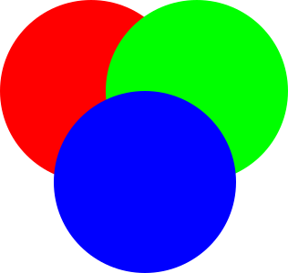
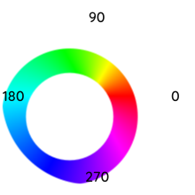
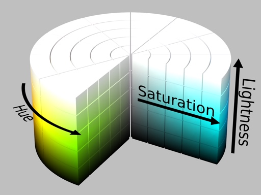
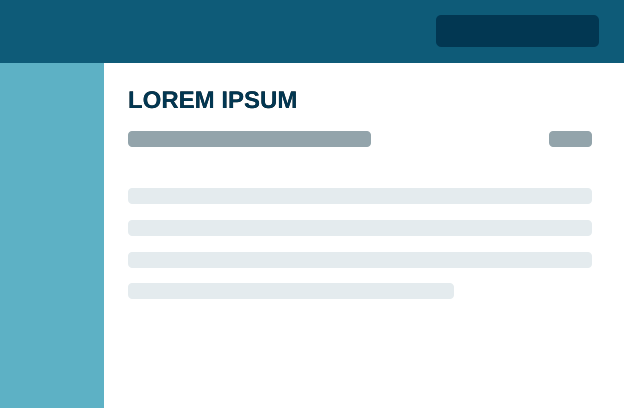
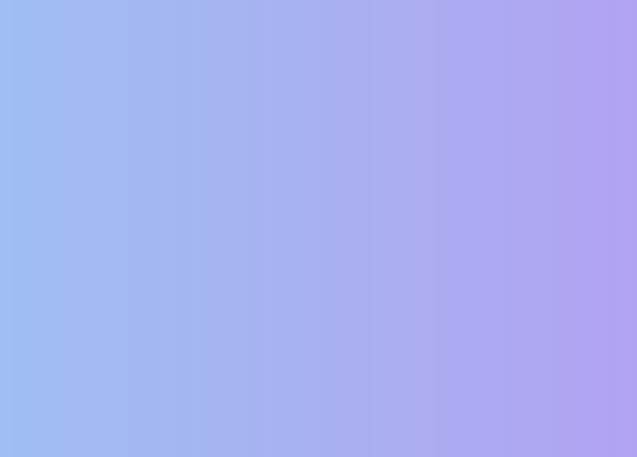
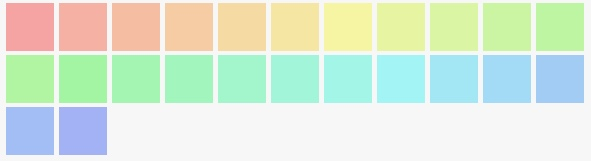
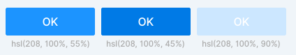

ในการทำงานของ Web Designer และ Frontend Developer แทบทุกคน คงหนีไม่พ้นที่จะต้องทำงานเกี่ยวข้องกับเรื่องของ "สี" อย่างแน่นอน ซึ่งใน CSS นั้น เราก็มักจะเห็นการใช้งาน ในรูปแบบของ RGB Color (Red Green Blue) เป็นส่วนใหญ่

ในบทความนี้ จะมาพูดถึงรูปแบบของสี อีกรูปแบบหนึ่ง นั่นคือ HSL Color (Hue Saturation Lightness) ซึ่งมีข้อดูข้อเสีย และช่วยให้ชีวิตเราง่ายขึ้นได้อย่างไรนั้น ผมจะเล่าให้ฟังครับ แต่ก่อนอื่น เรามาทำความรู้จักกับ ระบบสี RGB Color คร่าว ๆ กันก่อนครับ

## RGB Color: ระบบสียอดนิยม จากการผสมกันของแม่สีทั้งสาม

ระบบสีแบบ RGB Color เป็นระบบสีที่ใช้งานได้ค่อนข้างสะดวก นั่นก็เพราะว่าเพราะเครื่องมือ และ Library ต่าง ๆ ในงาน Programing และงาน Design มักจะใช้เป็นระบบสี RGB Color เป็นหลัก

ใน CSS เราสามารถกำหนดค่าของ RGB Color ได้สองแบบคือ

1. **RGB functions:** rgb(R, G, B) โดยค่าของแม่สี R, G และ B มีค่าสูงสุด 256 ระดับ ตั้งแต่ 0 ถึง 255 เช่น

	-  rgb(255, 0, 0)
	-  rgb(100, 0, 100)
	-  rgb(0, 0, 0)
	-  rgb(255, 255, 255)
2. **RGB Hex notation:** #RRGGBB โดยค่าของแม่สี R, G และ B มีค่าสูงสุด 256 ตั้งแต่ 00 ถึง FF เช่น

	-  #ff0000
	-  #640064
	-  #000000
	-  #FFFFFF

	
	<em>ภาพการผสมกันของแม่สี</em>

การผสมสีของแม่สีในระบบ RGB Color **แดง**, **เขียว** และ **น้ำเงิน** หลายคนอาจจะสงสัยว่า ทำไมเอาสีมาผสมกันถึงได้เป็นสีขาว ไม่กลายเป็นสีดำ เหมือนเวลาที่เราเอาสีน้ำมาผสมกัน ? นั่นก็เพราะว่า การผสมกันของสีแสง เป็นการผสมสีแบบ **Addition** (บวก) แต่สีในทางเคมีเป็นการผสมแบบ **Subtraction** (ลบ)

นั่นก็คือ สีในรูปของแสงนั้น ยิ่งเราเอาสีมาผสมกันมากเท่าไร ผลลัพธ์ก็จะยิ่งเข้าใกล้สีขาว rgb(255, 255, 255) มากขึ้นเท่านั้นครับ

## จุดด้อยของ RGB
RGB Color มีจุดด้อยอยู่อย่างหนึ่งคือ เป็นระบบสีที่เหมาะกับคอมพิวเตอร์ แต่มนุษย์เข้าใจได้ยาก ซึ่งในงานจริง การจัดการเรื่องสี มีความสำคัญ และซับซ้อนมาก โดยเฉพาะในการทำเว็บสมัยใหม่ ที่มี Design Systems ที่ต้องดูแล มักจะประกอบสีหลาย ๆ แบบ เช่น Primary Color, Accent Color, Semantic Color หลาย ๆ แบบ หลาย ๆ ระดับ

มนุษย์เรา จะอ้างอิงถึงสีใด ๆ ก็จะใช้คำพูด ประมาณว่า:

- เอาสีนี้ แต่ขอสว่างกว่านี้อีกนิด
- ลดความสดของสีนี้ลงมานิดนึง
- เอาโทนประมาณนี้ แต่ลองเปลี่ยนเป็นสีแดงได้ไหม ?

เราคงผสมสีเองในหัวไม่ได้แน่ ๆ เอาแค่ว่า #fe2315 กับ #e43152 คือสีอะไร และต่างกันอย่างไร ก็เห็นภาพยากแล้วใช่ไหมครับ แล้วลองคิดภาพดูว่า ถ้าสีใน Design Systems เราใช้เป็น RGB Color ทั้งหมด เวลาเราดูแล หรือปรับเปลี่ยนอะไรจะยุ่งยากแค่ไหน

## HSL Color: ระบบสีที่เป็นมิตรกับมนุษย์
ระบบสีแบบ HSL Color เป็นระบบสีที่มนุษย์จัดการได้ง่าย ต่างจาก RGB Color คือ เป็นระบบสี ที่ไม่ได้สร้างด้วยการผสมสีของแม่สี แต่เป็นระบบสีที่ประกอบจาก Hue (เนื้อสี), Saturation (ความอิ่ม) และ Lightness (ความสว่าง)

ใน CSS ใช้งาน HSL Color ได้ในรูปแบบของ function hsl() และ hsla() เช่น

-  hsl(0, 100%, 50%)
-  hsl(120, 100%, 50%)
-  hsl(240, 100%, 50%)

### Hue
Hue คือเนื้อสี มีค่าได้ 360 ค่า ตั้งแต่ 0 ถึง 359

ทำไมถึงเป็น 360 ค่า ?

นั้นก็เพราะว่า Hue ใช้การกำหนดค่าในรูปแบบของ Color Wheel โดยแต่ละค่าของ Hue ก็คือแต่ละ Degree บน Color Wheel นั่นเอง นั่นหมายความว่า ถ้าเรากำหนดค่า Hue เป็น 0, 360 หรือ 720 ก็จะได้เนื้อสีเดียวกันครับ

	
	<em>Hue color wheel</em>

หน้าตาของ Color Wheel ก็จะมีหน้าตาคล้าย ๆ กับการเอาสายรุ้งมาม้วนเป็นวงกลม โดยสีแดง จะอยู่ที่ 0 องศา, สีเขียว อยู่ที่ 120 องศา และสีน้ำเงินอยู่ที่ 240 องศา ใครเคยท่องสีรุ้งตอนเด็ก ๆ ก็เอามาใช้ได้เลยครับ

> ม่วง น้ำเงิน คราม เขียว เหลือง แสด แดง

เห็นไหมครับว่า เราสามารถ "กะ" เนื้อสีที่เราต้องการได้ง่ายมาก ๆ เช่น Hue ของสีน้ำเงินอมม่วง นิดนึง ก็น่าจะประมาณ 260 ถูกไหมครับ เพราะสีน้ำเงินสด คือ 240

### Saturation
Saturation คือความอิ่มของสี มีหน่วยเป็นเปอร์เซ็นต์ ตั้งแต่ 0% ถึง 100% การเพิ่มลดค่า Saturation ก็เปรียบเสมือนการเพิ่มลดเนื้อสี ลงไปมากน้อยแค่ไหน โดยที่ 0% จะเหมือนว่าเราไม่ได้เจือสีลงไป ก็จะได้ผลลัพธ์เป็นสี Grayscale จืด ๆ นั่นเอง

ตัวอย่าง Saturation ค่าต่างๆ ในสีเดียวกัน

-  hsl(240, 100%, 50%)
-  hsl(240, 60%, 50%)
-  hsl(240, 30%, 50%)
-  hsl(240, 10%, 50%)
-  hsl(240, 0%, 50%)

### Lightness

Lightness คือความสว่างของสี มีหน่วยเป็นเปอร์เซ็นต์ ตั้งแต่ 0% ถึง 100% การเพิ่มลด Lightness จะเหมือนการเราเอาสีขาว หรือสีดำ ผสมลงไปที่ Hue ที่เราเลือก

 ที่ 50% คือค่าตั้งต้น จะมีสีเป็นสีเทา โดยที่ค่าที่มากกว่า 50% จะมีความขาวมากขึ้น หรือที่เรียกว่า **tints** และค่าที่ต่ำกว่า 50% จะมีความดำมากขึ้น หรือที่เรียกว่า **shades** นั่นเอง

ตัวอย่าง Lightness ค่าต่างๆ ในสีเดียวกัน

-  hsl(240, 100%, 100%)
-  hsl(240, 100%, 80%)
-  hsl(240, 100%, 50%)
-  hsl(240, 100%, 20%)
-  hsl(240, 100%, 0%)

	
	<em>HSL Cylinder</em>

## การใช้งาน HSL Color

ด้วยข้อดีของ HSL Color ทำให้เราสามารถ เลือกสี คุมโทน และจัดการสีใน Design System ในสเกลต่าง ๆ ทั้งเล็ก และใหญ่ ได้ง่ายขึ้นมาก มาดูตัวอย่างการใช้งาน HSL Color กันครับ

### คุมโทนด้วย Mono Color
เราสามารถใช้สี เพียงสีเดียว และคุมโทนด้วยการ ปรับ Saturation และ Lightness เพื่อให้สีโดยรวม ดูเป็นโทนเดียวกัน ไม่หลุดโทน ซึ่งมีประโยชน์มาก ในการทำ Branding Color ให้แข็งแกร่ง

	
	<em>การใช้งานสีเพียง Hue เดียว</em>

### สร้าง Gradient จากสีหนึ่งไปอีกสีหนึ่ง

ไล่สีสองสีให้ดูเป็นธรรมชาติ ด้วยการปรับ Saturation และ Lightness ของทั้งสองสี ให้มีค่าเท่ากัน และ ปรับ Hue ให้ต่างกันเพียงเส็กน้อย

	
	<em>การไล่สีของ hsl(220, 80%, 80%) และ hsl(250, 80%, 80%)</em>

### สร้าง Palette สี

สร้าง Pallet สีให้มีอารมณ์คล้าย ๆ กัน ไม่รู้สึกหลุดไปจากกลุ่ม ด้วยการ ปรับ Saturation และ Lightness ของทุกสีให้เท่ากัน

	
	<em>Palette ของสีที่มี Saturation และ Lightness เท่ากัน</em>

### เลือกสีให้ State ต่าง ๆ ของ Button

Button ในงาน UI นั้นไม่ได้มีแค่เพียงสีเดียว แต่ยังมีสีใน State ต่าง ๆ ซ่อนอยู่อีก ไม่ว่าจะเป็น สีตอนปรกติ, สีเมื่อ Hover และ สีเมื่อ Disabled

- ใช้สีที่มี Hue เดียวกัน และปรับ Lightness ลงน้อย เพื่อแสดง Feedback เมื่อมีการ Hover
- ใช้สีที่มี Hue เดียวกัน และปรับ Lightness ขึ้น เพื่อแสดงสถานะ Disabled

	
	<em>Button ที่ State normal, hover และ disabled</em>

## ข้อเสียของ HSL Color

HSL ปลอดภัยอย่างมากในการใช้งาน Browser ก็รองรับทั้งหมดแล้ว แต่จะพูดถึงแต่ข้อดีก็คงไม่ได้ ซึ่งการใช้งาน HSL Color มีข้อเสีย ที่ผมคิดว่าน่าสนใจอยู่เล็กน้อย เมื่อเทียบกับ RBG Color คือ

1. **แทนจำนวนสีได้น้อยกว่า** – RGB Color สามารถใช้แทนจำนวนสีได้ถึง 256×256×256 = 16,777,216 สี แต่ HSL Color แทนสีได้จำนวนเพียง 360×100×100 = 3,600,000 สี
2. **ไม่คล่องตัว** – นอกจากใน CSS แล้ว Design Tool ยอดนิยมในตลาดตอนนี้ ยังไม่มีระบบสี HSL ให้เลือกใช้

เป็นยังไงกันบ้างครับกับ HSL Color หวังว่าจะมีประโยชน์ กับทั้ง Designer และ Developer นะครับ
