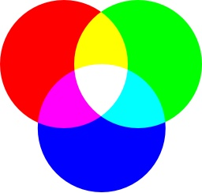
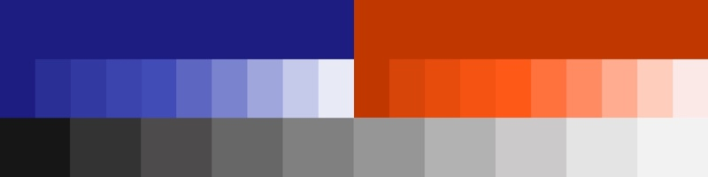
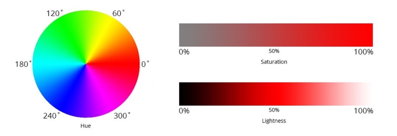
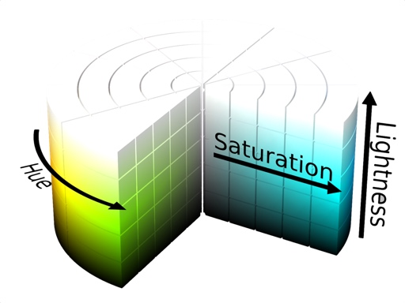
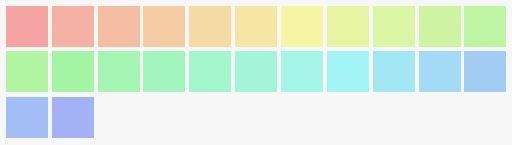

Web Designer และ Frontend Developer ทุกคน คงหนีไม่พ้น ที่จะต้องทำงานที่เกี่ยวข้องกับเรื่องของ “สี” อย่างแน่นอน ซึ่งใน CSS ก็รองรับการใช้งานสี ในรูปแบบต่าง ๆ แต่ที่นิยมที่สุดคือ RGB Color (Red, Green, Blue) ในรูป function rgb(), rgba() และ HEX notation

ในบทความนี้ ผมจะมาพูดถึงรูปแบบของสี อีกรูปแบบหนึ่ง คือ HSL Color (Hue, Saturation, Lightness) ซึ่งจะมีข้อดีข้อเสีย และช่วยให้เราทำงานง่ายขึ้นได้อย่างไรนั้น ผมจะเล่าให้ฟังครับ แต่ก่อนอื่น เรามาทำความรู้จักกับระบบสี RGB Color กันก่อนครับ

## RGB Color สีจากการผสมแม่สี

ระบบสีแบบ RGB Color เป็นระบบสีที่ใช้งานได้สะดวก เพราะว่า Tool และ Library ต่าง ๆ ในงาน Programing และงาน Design มักจะใช้ระบบสี RGB Color เป็นมาตรฐานอยู่แล้ว

โดยใน CSS เราสามารถกำหนดค่าของ RGB Color ได้สองแบบคือ

1. **RGB function** – ```rgb(Red, Green, Blue)``` ค่าของ Red, Green และ Blue จะมีค่าสูงสุด 256 ระดับ ตั้งแต่ 0 ถึง 255 เช่น

	- <span class="_w-16px _h-16px _dp-ilb _bdrd-32px" style="background: rgb(255, 0, 0)"></span> rgb(255, 0, 0)
	- <span class="_w-16px _h-16px _dp-ilb _bdrd-32px" style="background: rgb(100, 0, 100)"></span> rgb(100, 0, 100)
	- <span class="_w-16px _h-16px _dp-ilb _bdrd-32px" style="background: rgb(0, 0, 0)"></span> rgb(0, 0, 0)
	- <span class="_w-16px _h-16px _dp-ilb _bdrd-32px _bdw-1px _bdcl-gray" style="background: rgb(255, 255, 255)"></span> rgb(255, 255, 255)
2. **Hex notation** – ```#RRGGBB``` ค่าของ Red, Green และ Blue มีค่าสูงสุด 256 ระดับ ตั้งแต่ 00 ถึง FF เช่น

	- <span class="_w-16px _h-16px _dp-ilb _bdrd-32px" style="background: #ff0000"></span> #ff0000
	- <span class="_w-16px _h-16px _dp-ilb _bdrd-32px" style="background: #640064"></span> #640064
	- <span class="_w-16px _h-16px _dp-ilb _bdrd-32px" style="background: #000000"></span> #000000
	- <span class="_w-16px _h-16px _dp-ilb _bdrd-32px _bdw-1px _bdcl-gray" style="background: #FFFFFF"></span> #FFFFFF

### การเลือกสี ให้ได้สีที่เราต้องการ

การเลือกสีในรูปแบบของ RGB Color คือการเอาสี **Red**, **Green** และ **Blue** ที่ค่าต่าง ๆ มาผสมกัน จนได้สีที่เราต้องการ เพื่อน ๆ อาจจะสงสัยว่า ทำไมเอาสีมาผสมกันถึงได้เป็นสีขาว ไม่กลายเป็นสีดำเหมือนการเอาสีน้ำ หรือสีโปสเตอร์ มาผสมกัน ?

นั่นก็เพราะว่า RBG Color เป็นการผสมกันของสีแสง ซึ่งมีการผสมสีแบบ **Additive** (บวกกัน) ก็คือยิ่งเอาสีมาบวกกัน ก็จะยิ่งกลายเป็น rgb(255, 255, 255) หรือสีขาว ให้เรามองเห็น

ซึ่งจะมีความแตกต่าง จากการผสมสีทางเคมี ที่เราคุ้นเคยในชีวิตประจำวัน เช่นงานพิมพ์ งานย้อมสี ที่เป็นการผสมแบบ **Subtractive** (ลบกัน) คือกระบวนการดูดซับ Spectrum สี ของแสงที่สะท้อนเข้าตาเราครับ

<p class="_tal-ct">
	<picture class="_mgt-32px">
		<source srcset="rgb-addition@2x.webp 2x, rgb-addition.webp 1x" type="image/webp">
		<source srcset="rgb-addition@2x.jpg 2x, rgb-addition.jpg 1x" type="image/jpeg">
		
		<em>การผสมสีแบบ Additive</em>
	</picture>
</p>

## ข้อเสียของ RGB Color

RGB Color มีข้อเสียอยู่อย่างหนึ่งคือ เป็นระบบสีที่ใช้สำหรับคอมพิวเตอร์ แต่มนุษย์เข้าใจได้ยาก

ในงานจริงนั้น การจัดการเรื่องสี มีความสำคัญ และซับซ้อนมาก โดยเฉพาะในการทำเว็บสมัยใหม่ ที่มีการออกแบบอย่างเป็นระบบ มีการสร้าง Color Palette ใน Design Systems ที่ต้องการการดูแล ซึ่งก็มักจะประกอบด้วยสีจำนวนมาก เช่น Primary Color, Accent Color, Semantic Color หลาย ๆ แบบ และหลาย ๆ ระดับความเข้ม

<p class="_tal-ct">
	<picture class="_mgt-32px">
		<source srcset="palette-systems@2x.webp 2x, palette-systems.webp 1x" type="image/webp">
		<source srcset="palette-systems@2x.jpg 2x, palette-systems.jpg 1x" type="image/jpeg">
		
		<em>ส่วนหนึ่งของ Color Palette ใน Design Systems</em>
	</picture>
</p>

#### มนุษย์กับ “สี”

*เพิ่มแดงอีก 16, เขียวอีก 20 จะได้ดูสว่างกว่านี้หน่อย...*, *ตรงนี้มันออกแดงไปนิด ลดสีแดงลง 30 ต้องเพิ่มน้ำเงินขึ้นอีก 16 ด้วยนะจะได้มีโทนเดิน...*

อาจฟังดูไม่ค่อยคุ้นหู งั้นถ้าเป็นแบบนี้ล่ะ

- เอาสีนี้ แต่ขอสว่างกว่านี้อีกนิด
- ตรงนี้สดไปหน่อย เอาสว่างเท่านี้ลดความสดลงมาหน่อย
- เอาโทนสีประมาณนี้ แต่ลองเปลี่ยนเป็นสีแดงดู

ใช่ครับโลกความเป็นจริง เราสื่อสารกันแบบนี้ เพราะเราไม่สามารถสร้าง Mental Model การผสมสีในหัว ได้ง่าย ๆ เอาแค่ว่า ```#fe2315``` กับ ```#e43152``` คือสีอะไร และต่างกันอย่างไร ก็ยากแล้วใช่ไหมครับ แล้วถ้าสีใน Design Systems เราใช้เป็น RGB Color ทั้งหมด การสื่อสาร การดูแล หรือปรับเปลี่ยนอะไร จะยุ่งยากแค่ไหน

## HSL Color ระบบสีที่เป็นมิตรกับมนุษย์มากกว่า

HSL Color เป็นระบบสีที่มนุษย์ เข้าใจได้ง่าย เพราะไม่ได้นิยามสีจากการผสมสี แต่เป็นระบบที่สร้างสีขึ้นมาจาก Hue (เนื้อสี), Saturation (ความอิ่ม) และ Lightness (ความสว่าง)

<p class="_tal-ct">
	<picture class="_mgt-32px">
		<source srcset="hsl-system@2x.webp 2x, hsl-system.webp 1x" type="image/webp">
		<source srcset="hsl-system@2x.jpg 2x, hsl-system.jpg 1x" type="image/jpeg">
		
		<em>HSL Color Systems</em>
	</picture>
</p>

CSS ใช้งาน HSL Color ได้ในรูป function hsl(Hue, Saturation, Lightness) เช่น

- <span class="_w-16px _h-16px _dp-ilb _bdrd-32px" style="background: hsl(0, 100%, 50%)"></span> hsl(0, 100%, 50%)
- <span class="_w-16px _h-16px _dp-ilb _bdrd-32px" style="background: hsl(120, 100%, 50%)"></span> hsl(120, 100%, 50%)
- <span class="_w-16px _h-16px _dp-ilb _bdrd-32px" style="background: hsl(240, 100%, 50%)"></span> hsl(240, 100%, 50%)

### Hue

Hue คือเนื้อสี มีค่าได้ 360 ค่า ตั้งแต่ 0 ถึง 359

**ทำไมถึงเป็น 360 ค่า ?**

นั้นก็เพราะว่า Hue ใช้การกำหนดค่าในรูปแบบของ Color Wheel โดยแต่ละค่าของ Hue ก็คือแต่ละ Degree บน Color Wheel นั่นเอง นั่นหมายความว่า ถ้าเรากำหนดค่า Hue เป็น 0, 360 หรือ 720 ก็จะได้เนื้อสีเดียวกัน เพราะคือจุดเดียวกันบน Color Wheel ครับ

<p class="_tal-ct">
	
	<em>Hue color wheel</em>
</p>

Color Wheel ก็จะมีหน้าตาคล้าย ๆ กับการเอาสายรุ้งมาม้วนเป็นวงกลม โดยสีแดง จะอยู่ที่ 0 องศา, สีเขียว อยู่ที่ 120 องศา และสีน้ำเงินอยู่ที่ 240 องศา ใครเคยท่องสีรุ้งตอนเด็ก ๆ ก็เอามาใช้ได้เลยครับ

> ม่วง น้ำเงิน คราม เขียว เหลือง แสด แดง

เราสามารถ “กะ” เนื้อสีที่เราต้องการได้ง่าย เช่น Hue ของสีน้ำเงินอมม่วง นิดนึง ก็น่าจะประมาณ 260 ถูกไหมครับ เพราะสีน้ำเงินสด คือ 240

### Saturation

Saturation คือความอิ่มของสี มีหน่วยเป็นเปอร์เซ็นต์ ตั้งแต่ 0% ถึง 100% การเพิ่มลดค่า Saturation ก็เปรียบเสมือนการเพิ่มลดเนื้อสี ว่าใส่สีลงไปมากน้อยแค่ไหน โดยที่ 0% จะเหมือนว่าเราไม่ได้เจือสีลงไป ก็จะได้ผลลัพธ์เป็นสี Grayscale จืด ๆ นั่นเอง

ตัวอย่าง Saturation ค่าต่างๆ

- <span class="_w-16px _h-16px _dp-ilb _bdrd-32px" style="background: hsl(240, 100%, 50%)"></span> hsl(240, 100%, 50%)
- <span class="_w-16px _h-16px _dp-ilb _bdrd-32px" style="background: hsl(240, 60%, 50%)"></span> hsl(240, 60%, 50%)
- <span class="_w-16px _h-16px _dp-ilb _bdrd-32px" style="background: hsl(240, 30%, 50%)"></span> hsl(240, 30%, 50%)
- <span class="_w-16px _h-16px _dp-ilb _bdrd-32px" style="background: hsl(240, 10%, 50%)"></span> hsl(240, 10%, 50%)
- <span class="_w-16px _h-16px _dp-ilb _bdrd-32px" style="background: hsl(240, 0%, 50%)"></span> hsl(240, 0%, 50%)

### Lightness

Lightness คือความสว่างของสี มีหน่วยเป็นเปอร์เซ็นต์ ตั้งแต่ 0% ถึง 100% การเพิ่มลด Lightness จะเหมือนการที่เราเอาสีขาว หรือสีดำ ผสมลงไปที่ Hue

ที่ 50% คือค่าตั้งต้น จะมีสีเป็นสีเทา โดยที่ค่าที่มากกว่า 50% จะมีความขาวมากขึ้น หรือที่เรียกว่า **tints** และค่าที่ต่ำกว่า 50% จะมีความดำมากขึ้น หรือที่เรียกว่า **shades** นั่นเอง

ตัวอย่าง Lightness ค่าต่าง ๆ

- <span class="_w-16px _h-16px _dp-ilb _bdrd-32px _bdw-1px _bdcl-gray" style="background: hsl(240, 100%, 100%)"></span> hsl(240, 100%, 100%)
- <span class="_w-16px _h-16px _dp-ilb _bdrd-32px" style="background: hsl(240, 100%, 80%)"></span> hsl(240, 100%, 80%)
- <span class="_w-16px _h-16px _dp-ilb _bdrd-32px" style="background: hsl(240, 100%, 50%)"></span> hsl(240, 100%, 50%)
- <span class="_w-16px _h-16px _dp-ilb _bdrd-32px" style="background: hsl(240, 100%, 20%)"></span> hsl(240, 100%, 20%)
- <span class="_w-16px _h-16px _dp-ilb _bdrd-32px" style="background: hsl(240, 100%, 0%)"></span> hsl(240, 100%, 0%)

<p class="_tal-ct">
	<picture class="_mgt-32px">
		<source srcset="hsl-cylinder@2x.webp 2x, hsl-cylinder.webp 1x" type="image/webp">
		<source srcset="hsl-cylinder@2x.jpg 2x, hsl-cylinder.jpg 1x" type="image/jpeg">
		
		<em>HSL Cylinder</em>
	</picture>
</p>

## การใช้งาน HSL Color

ด้วย HSL Color ทำให้เราสามารถเลือกสี, คุมโทน และจัดการสีในสเกลต่าง ๆ ทั้งเล็ก และใหญ่ ได้ง่ายขึ้นมาก มาดูตัวอย่างการใช้งาน HSL Color กันครับ

### คุมโทนด้วย Mono Color
เราสามารถใช้สี เพียงสีเดียว และคุมโทนสีด้วยการ ปรับ Saturation และ Lightness เพื่อให้สีโดยรวม เป็นสีเดียวกัน ที่โทนสีต่าง ๆ

<p class="_tal-ct">
	
	<em>การใช้งานสีเพียง Hue เดียว</em>
</p>

### สร้าง Gradient จากสีหนึ่งไปอีกสีหนึ่ง

ไล่สีสองสีให้ดูเป็นธรรมชาติ ด้วยการปรับ Saturation และ Lightness ของทั้งสองสี ให้มีค่าเท่ากัน และ ปรับ Hue ให้ต่างกันเพียงเล็กน้อย

<p class="_tal-ct">
	
	<em>การไล่สีของ hsl(220, 80%, 80%) และ hsl(250, 80%, 80%)</em>
</p>

### สร้าง Color Palette

สร้าง Color Palette ให้มีโทนเดียวกัน ไม่รู้สึกหลุดไปจากกลุ่ม ด้วยการ ปรับ Saturation และ Lightness ของทุกสีให้เท่ากัน

<p class="_tal-ct">
	
	<em>Color Palette ของสี ที่มี Saturation และ Lightness เท่ากัน</em>
</p>

### เลือกสีให้ State ต่าง ๆ ของ Button

UI Element เช่น Button นั้นไม่ได้มีแค่ State เดียว แต่ยังมี State ต่าง ๆ ซ่อนอยู่ ที่อาจจำเป็นต้องใช้สี ที่มีความสว่างต่าง ๆ กัน เพื่อแสดงความแตกต่างในแต่ละ State ไม่ว่าจะเป็น สีตอนปรกติ, สีเมื่อ Hover หรือสีเมื่อ Disabled

ตัวอย่างเช่่น

- ใช้สีที่มี Hue เดียวกัน และปรับ Lightness ลงน้อย เพื่อแสดง Feedback เมื่อมีการ Hover
- ใช้สีที่มี Hue เดียวกัน และปรับ Lightness ขึ้น เพื่อแสดงสถานะ Disabled

<p class="_tal-ct">
	
	<em>Button ที่ State normal, hover และ disabled</em>
</p>

## จุดอ่อนของ HSL Color

HSL ในตอนนี้ ปลอดภัยอย่างมากในการใช้งาน Browser ก็<a href="https://caniuse.com/#search=hsl" target="_blank" rel="noreferrer noopener" class="bio-link -fancy">รองรับทั้งหมด</a>แล้ว

แต่การใช้งาน HSL Color มีข้อเสีย ที่น่าสนใจอยู่เล็กน้อย คือ

1. **แทนจำนวนสีได้น้อยกว่า** – RGB Color สามารถใช้แทนจำนวนสีได้ถึง 256×256×256 = 16,777,216 สี แต่ HSL Color แทนสีได้จำนวนเพียง 360×100×100 = 3,600,000 สี
2. **ความคล่องตัวต่ำ** – นอกจากใน CSS แล้ว Design Tool ที่นิยมในตลาดตอนนี้ ก็ยังไม่มีระบบสี HSL ให้เลือกใช้ (มี HSB แต่ว่าต้องคำนวนเพื่อแปลงค่า)

### ส่งท้าย

เป็นยังไงกันบ้างครับ กับ HSL Color หวังว่าบทความนี้ จะเป็นประโยชน์ กับทั้ง Designer และ Developer นะครับ

นี่เป็นบทความแรก ที่ผมเขียนครับ ไม่รู้ว่าเขียนอ่านยากไหม แต่จะพยายามเขียนให้ดีขึ้นครับ ถ้าชอบก็ฝากแชร์ด้วยนะครับ ฮาาา พบกันใหม่โพสหน้า สวัสดีครับ
