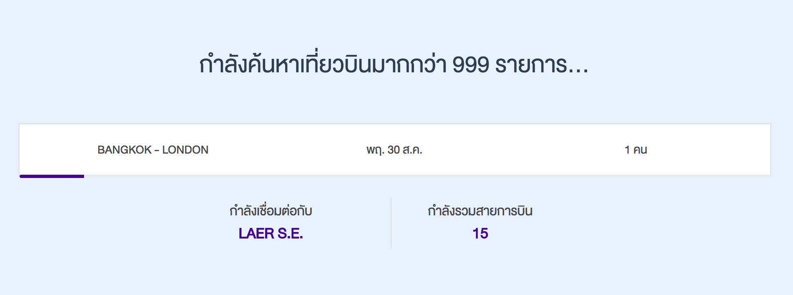
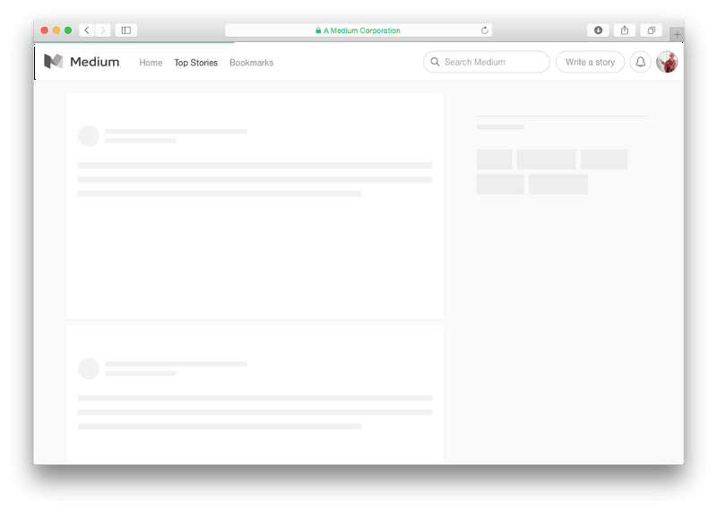
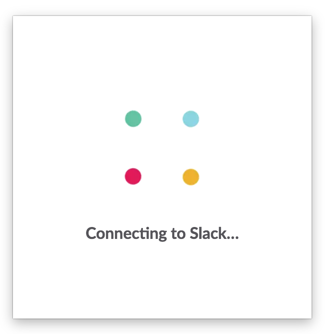
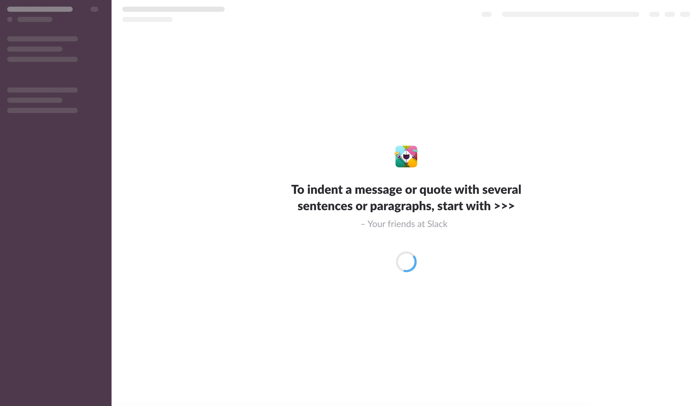

ถ้าจะพูดถึงเหตุผลอันดับต้น ๆ ในการใช้งาน Website ที่ทำให้ User อารมณ์เสีย คงหนีไม่พ้นเรื่องเว็บช้า ไม่ว่าจะเป็น โหลดช้า ประมวลผลช้า ถ้า User “รู้สึก” ว่ามันช้าเกินไปแล้วละก็ แย่แน่ ๆ ครับ

เราจึงต้องหาสารพัดวิธี ที่จะ Optimize Performance ของเว็บเราให้ดีขึ้น โดยในบทความก่อนหน้านี้ ผมก็ได้พูดถึงการ <a href="https://chanto.io/2018/07/how-to-optimize-your-website/" target="_blank" class="bio-link -fancy">Optimize Performance เบื้องต้น</a> สำหรับ Frontend Developer กันไปแล้ว

แต่การ Optimize Performance ไม่ใช่เรื่อง Engineer เสมอไป แต่เป็นสิ่งที่ Designer ก็สามารถช่วยคิด และช่วยทำได้เช่นกัน เผลอ ๆ อาจจะ **คุ้มค่า และทรงพลัง กว่าการแก้ไขทาง Engineer** อีกด้วย

## Perceived Performance

Steve Seow จาก Microsoft ค้นพบว่า การที่ User จะเริ่มรู้สึกถึงความแตกต่างใน Performance นั้น เราจะต้องทำให้ เว็บเราเร็วขึ้นกว่าเดิม 20%<a href="#1" class="bio-link">[1]</a> (แค่เริ่มรับรู้ถึงความแตกต่างนะครับ)

หมายความว่า ถ้าเราจะทำให้ความเปลี่ยนแปลงนั้น เกิด Impact จริง ๆ อาจจะต้องทำให้เว็บเร็วขึ้น ถึงประมาณ 30% เลยทีเดียว OMG! 😱 ไม่ใช่น้อย ๆ เลยนะครับ

ปัญหาก็คือว่า ในความเป็นจริง เราอาจไม่สามารถควบคุมทุกอย่างได้ ยิ่งโปรเจคที่มี Codebase ขนาดใหญ่ หรือมี Infrastructure ที่ซับซ้อน การ Optimize ให้เว็บให้เร็วขึ้น ก็เป็นเรื่องที่ยากมากแล้ว จะให้เร็วขึ้นถึง 30% นั้น เขียนใหม่หมดเลย อาจจะง่ายกว่าก็ได้

**แล้วทำไมเราถึงต้องดิ้นรนในการ Optimize codebase หรือ Infrastructure ล่ะ ?**

นั่นก็เพราะว่า มันสามารถทำการวัดผลวัดผล, เปรียบเทียบความเปลี่ยนแปลง และสรุปผลได้ง่าย เพราะทุกอย่าง ถูกวัดค่าเป็นตัวเลขได้หมดครับ

แต่ในความเป็นจริง User ไม่ได้ใช้งานเว็บเรา พร้อมกับนาฬิกาจับเวลาครับ ถึงเว็บเราจะทำงานช้า แต่ถ้าเราทำให้ User “รู้สึก” เร็วได้ ก็จบครับ ความรู้สึกเร็วที่ User รับรู้นี่แหละ ที่เราเรียกว่า Perceived Performance

> สำหรับ User นั้น, Web Performance ไม่ใช่เรื่องของตัวเลข หรือ Score แต่เป็นเรื่องของความรู้สึก และการรับรู้

## เวลาเป็นเรื่องตลก บางครั้งมันก็เดินช้า บางครั้งก็เดินเร็ว

เคยรู้สึกไหมว่า บางครั้ง เวลาช่างผ่านไปไวเสียเหลือเกิน โดยเฉพาะเวลาแห่งความสุข 😍 แต่บางครั้ง เวลาก็ผ่านไปช้ามาก เช่นเวลาที่เราต้องรอใครซักคน (เอ๊า! ดราม่าซะงั้น)

Jeremy Dean นักจิตวิทยา กล่าวไว้ว่า “เวลาจะไม่เดินเมื่อเราสนุก” เหมือนที่คนไทยชอบพูดว่า “สนุกจนลืมเวลา” นั่นแหละครับ

โดยในการทำกิจกรรมแต่ละอย่าง เราจะแบ่งการใช้เวลาออกได้เป็น 2 Phases ครับ คือ

- **Active Phase** – คือเวลาที่เราสนุก, ให้ความสนใจกับอะไรบางอย่าง หรือเวลาที่เราใช้หัวเยอะ ๆ
- **Passive Phase** – คือเวลาที่เราคิ้วขมวด เดินวนไปวนมา หรือนั่งรอครับ

Richard Larson นักวิจัยจาก MIT ระบุว่า **มนุษย์จะรับรู้ถึง Passive Phase เกินจริงไปถึง 36%!!!**<a href="#2" class="bio-link">[2]</a> 😱

ยกตัวอย่างเช่น

เวลาเราไปกินข้าว ตอนที่เราเลือกเมนู ซึ่งใช้เวลาพอสมควร (Active Phase) แต่กลับไม่รู้สึกว่าเวลาผ่านไปเลย แต่ระหว่างที่เรารออาหารที่สั่ง (Passive Phase) ซึ่งก็ใช้เวลาพอกัน แต่ทำไมถึงรู้สึกว่าเรานั่งรออาหารนานเหลือเกิน

หรืออีกตัวอย่างคือ บนถนนที่รถติดมาก ระหว่างที่เราหัวร้อน เพราะรถขยับไปได้ทีละนิด ๆ ช่างดูยาวนานเหลือเกิน (Passive สลับ Active) กว่าจะถึงบ้าน, แต่เมื่อเทียบกับการปั่นจักรยานไปเรื่อย ๆ (Active อย่างเดียว) ทั้งที่ใช้เวลาเดินทางพอ ๆ กัน แต่แบบหลัง กลับรู้สึกไวกว่า และ รู้สึกพอใจ (Satisfy) มากกว่า

## ทำให้ Active Phase ยาวขึ้น และ Passive Phase เจ็บปวดน้อยลง

การเอาความรู้ในเรื่องเหล่านี้ มาใช้ในการออกแบบ ทำได้หลากหลายมาก และเป็นเรื่องที่สนุกมาก ๆ ด้วยครับ

ตัวอย่างที่เห็นได้ชัดในในโลกจริง คือ **สนามบิน**<a href="#2" class="bio-link">[2]</a> ครับ การที่สนามบินพยายาม ๆ ทำทางเดินยาว ก่อนที่จะไปถึงจุดรับกระเป๋าเดินทาง ก็เพื่อที่จะให้พนักงาน จัดการขนกระเป๋าให้เสร็จ ในระหว่างที่เราเดินครับ (Active Phase)

เราจึงรู้สึกว่า พอไปถึงจุดรับกระเป๋า กระเป๋าก็พร้อมในสายพานแล้ว ทำไมไวจัง

แต่ถ้าลองคิดเป็นว่า เราลงเครื่องบินมาแล้วเป็นจุดรับกระเป๋าเลย แล้วต้องมายืนรอกระเป๋าเฉย ๆ (Passive Phase) ดูสิครับ น่าเบื่อแย่เลย คนก็เยอะด้วย

สำหรับในเว็บ เราจะทำให้ Active Phase ยาวขึ้น และ Passive Phase เจ็บปวดน้อยลงได้หลายวิธี เช่น

1. ตอบสนองทันที
2. ทำให้ User สนุกกับการรอ
3. สร้าง Sense of Certainty ในระหว่างรอ
4. ดึงดูดความสนใจของ User
5. รีบ Render สิ่งที่สำคัญออกไปก่อน

ในการใช้งานเว็บ ตามปรกติแล้ว มนุษย์จะเริ่มรู้สึกตัวว่าจะต้องรอ และเปลี่ยนเป็นโหมดรอ ก็จะใช้เวลาประมาณ 1 วินาที<a href="#2" class="bio-link">[3]</a>

นั่นหมายความว่า กระบวนการที่ใช้เวลาน้อยกว่า 1 วินาที User จะยังรู้สึกว่า “มันทำงานทันที” อยู่ การใส่อะไรที่ Fancy ลงไป จึงต้องคิดให้ดีก่อน ว่ามันมีความหมาย ไม่ใช้การ Interrupt

สูตรง่าย ๆ ก็คือ

- **น้อยกว่า 1 วินาที** – ไม่ต้องสนใจก็ได้ หรือทำอะไรเพียงเล็กน้อย ถ้าจะใส่อะไร Fancy ให้คิดดี ๆ ก่อน เพราะอาจจะกลายเป็นการ Interrupt ความคิดของ User, แทนที่จะรู้สึกว่าไม่ได้รอ และยัง Focus กับ Action ที่กำลังทำอยู่ พอเห็น Loading Indicator จะกลายเป็นการเปลี่ยนไปโฟกัสว่า “อ่าว นี่ต้องรอนี่นา”
- **1-3 วินาที** – เริ่มใช้วิธี ดึงความสนใจ, Animation, Progressbar, Loading spinner ตามความเหมาะสม เพราะเป็นระยะเวลารอ ที่ยอมรับได้
- **3 วินาที ขึ้นไป** – จุดอันตราย เป็นจุดแตกหักที่ User อาจจะหัวเสีย จึงต้องใช้อะไรที่ดู Fancy ขึ้น, อธิบาย User ว่ากำลังเกิดอะไร, สร้าง Sense of Certainty หรือทำให้ User รู้สึกว่าการรอนี้มีประโยชน์

## ตัวอย่างการหลอก User ให้รู้สึกว่าเว็บ ทำงานเร็วกว่าความเป็นจริง

หนึ่งใน Topic นอกสายงาน ที่ผมชอบมากเรื่องนึง คือเรื่อง Human Psychology เป็นศาสตร์ ที่ทำให้เราเข้าใจ มนุษย์มากขึ้น (หรือเข้าใจน้อยลงหว่า 😂)

ความรู้สามารถนำไปประยุกต์กับเรื่องอื่น ๆ ได้มากมาย ไม่ว่าจะเป็น Interior design, Marketing หรือ Web Design

### ทำให้ Progress bar รู้สึกวิ่งไวกว่าที่ควรจะเป็น

Progress bar คือหนึ่งในอาวุธคู่กายของ Web มาช้านาน ใช้งานง่าย ใช้ได้หลายสถานการณ์ และ User เข้าใจได้ทันทีโดยที่ไม่ต้องเรียนรู้ แต่ไม่ได้หมายความว่า Progress bar จะเหมือนกันไปทั้งหมด

ลองดูตัวอย่าง Progress bar ต่อไปนี้ครับ

	

	

	

	

ถึงแม้ว่า Progress bar ทั้งสามอันจะใช้เวลาเท่ากัน แต่คุณน่าจะรู้สึกว่า อันที่สาม มันดูโหลดไวกว่าเพื่อนอยู่นิดหน่อย

เพียงแค่ใส่ Animation ให้ Progressbar มี Band และความเร่งในทิศทางตรงข้ามเพียงเล็กน้อย ก็ให้ความรู้สึกที่แตกต่างแล้ว

คล้าย ๆ กับการที่เรานั่งรถไฟ เมื่อมองออกไปนอกหน้าต่าง เห็นรถไฟที่วิ่งสวนมาในทิศตรงข้าม จะรู้สึกว่ารถไฟนั้นวิ่งเร็วกว่าปรกติครับ

### ถ้า Progressbar มีการหยุด ให้หยุดใกล้เส้นชัย

บางครั้ง Progress bar อาจจะต้องมีหยุด เพื่อรอโหลด หรือรอการประมวลผล อะไรบางอย่าง ถ้าต้องมีการหยุด ให้วิ่งไปหยุดรอที่ใกล้เส้นชัยครับ

ถึงแม้จะใช้เวลาเท่า ๆ กัน แต่การที่ User เห็น Progress bar ไปหยุดที่ 80% แล้วค่อยวิ่งต่อไปจนจบ จะรู้สึกว่ารออีกแค่นิดเดียว แต่เมื่อเทียบกับการหยุดที่ 20% แล้วค่อยวิ่งไปจนจบ จะรับรู้ว่า ต้องรออีกนานแน่ ๆ

ถึงจะรอเท่ากัน แต่ความรู้สึกด้านบวก ก็ต่างกันครับ

## เริ่มใช้ อะไรที่ Fancy ขึ้น

การที่จะให้ User รอมากกว่า 3 วินาทีขึ้นไป เราต้องทำให้ User รู้สึกว่ามีความหมาย และคุ้มค่าที่จะรอ เพื่อทำให้ Passive Phase ที่นาน มีความเจ็บปวดน้อยลงครับ

### อธิบาย User ว่ากำลังเกิดอะไร

ตัวอย่างเว็บ thaitravelcenter แทนที่จะใช้ Progressbar เพียงอย่างเดียว ก็ใช้การอธิบายถึงการทำงาน เพื่อค้นหาเที่ยวบินจำนวนมาก เพื่อให้ User รู้สึกว่าเป็นการรอที่คุณค่ากับเขา

	<picture class="_mgt-32px">
		
		<em>เว็บไซต์ thaitravelcenter</em>
	</picture>

### ใช้ Skeleton Screen

การใช้ Skeleton Screen ก็เป็นวิธีง่าย เพื่อให้ User รู้สึกว่า Content กำลังใกล้จะมาแล้ว

	<picture class="_mgt-32px">
		
		<em>Skeleton Screen ของเว็บไซต์ Medium</em>
	</picture>

### เพิ่มช่วงเวลา Active Phase

Gmail เปลี่ยนมาใช้ Animation ก่อนที่จะเริ่มแสดง Progress bar แทนการโหลดแบบเก่า ที่เป็นเพียง Progress bar ที่น่าเบื่อเฉย ๆ

Animation ช่วยดึงดูดความสนใจของ User (Active phase)

ทำให้ช่วงการแสดง Progress bar ที่น่าเบื่อ (Passive phase) สั้นลงมาก ๆ

<video autoplay muted loop class="_w-100pct">
	<source src="gmail.mp4" type="video/mp4">
</video>

วีดีโอเกมส์ เป็นตัวอย่างที่ทำเรื่องนี้ได้ดี เราน่าจะเคยเห็นฉากโหลดเกมส์ ที่มักจะมีอะไรแปลก ๆ มาให้เราอ่าน เช่นเนื้อเรื่อง, Battle tips หรือไม่ก็มาเป็น Video สวย ๆ ให้เราดูเลย

### ผสมผสานหลาย ๆ แบบ

เราสามารถใช้หลาย ๆ วิธี มาผสมกันได้ครับ ยกตัวอย่างสิ่งอื่นไปไม่ได้นอกจาก “Slack” ครับ

Slack เริ่มต้นมาด้วย Loading Spinner สวย ๆ มาดึงความสนใจของคุณ

	<picture class="_mgt-32px">
		
		<em>Slack's loading screen 1</em>
	</picture>

จากนั้นตามมาด้วย Skeleton Screen พร้อมกับ Quote สนุก ๆ ให้คุณอ่านระหว่างรอ (โหลดนานโครต)

	<picture class="_mgt-32px">
		
		<em>Slack's loading screen 2</em>
	</picture>

นี่ถ้า Slack ใช้เป็น Loading Spinner เพียงอย่างเดียว ทั้งหมดจะรู้สึกช้าแค่ไหนนะ

## สุดท้าย

การ Optimize Performance ไม่ใช่เรื่องน่าเบื่อ และไม่ได้ถูกจำกัดแค่ว่า เป็นเรื่องของ Engineering ยาก ๆ เสมอไปครับ เพราะสิ่งที่สำคัญในท้ายที่สุดคือ “ความรู้สึก” ครับ

### แหล่งอ้างอิง

- <small><a id="1" href="https://www.amazon.com/Designing-Engineering-Time-Psychology-Perception/dp/0321509188" target="_blank" class="bio-link" rel="noopener">[1] – Designing and Engineering Time: The Psychology of Time Perception in Software, Steven C. Seow</a></small>
- <small><a id="2" href="https://www.nytimes.com/2012/08/19/opinion/sunday/why-waiting-in-line-is-torture.html" target="_blank" class="bio-link" rel="noopener">[2] – Why Waiting Is Torture, nytimes</a></small>
- <small><a id="3" href="https://www.nngroup.com/articles/powers-of-10-time-scales-in-ux/" target="_blank" class="bio-link" rel="noopener">[3] – Powers of 10: Time Scales in User Experience, Jakob Nielsen</a></small>

