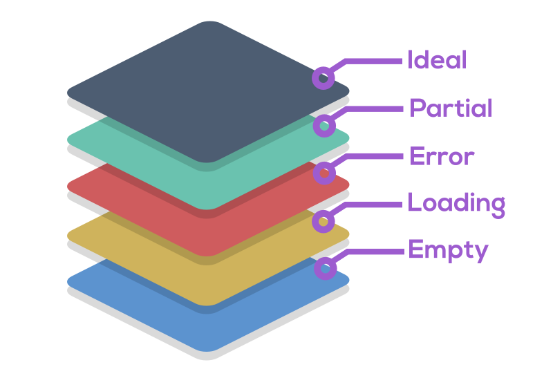
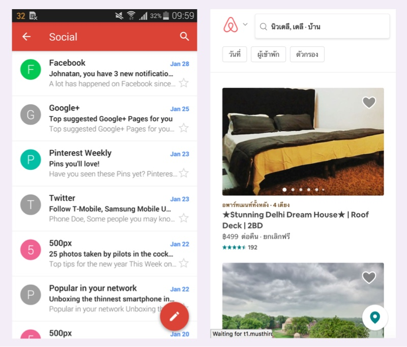
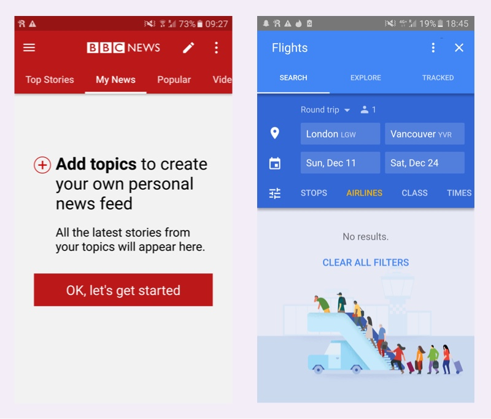
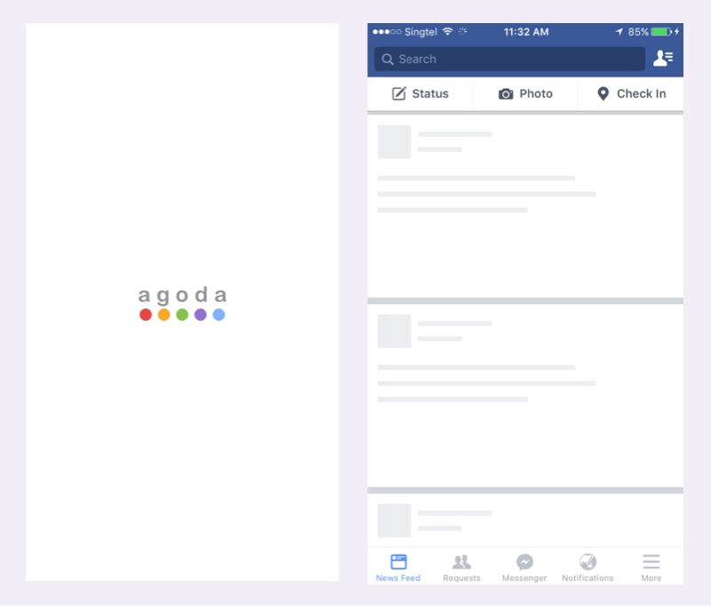
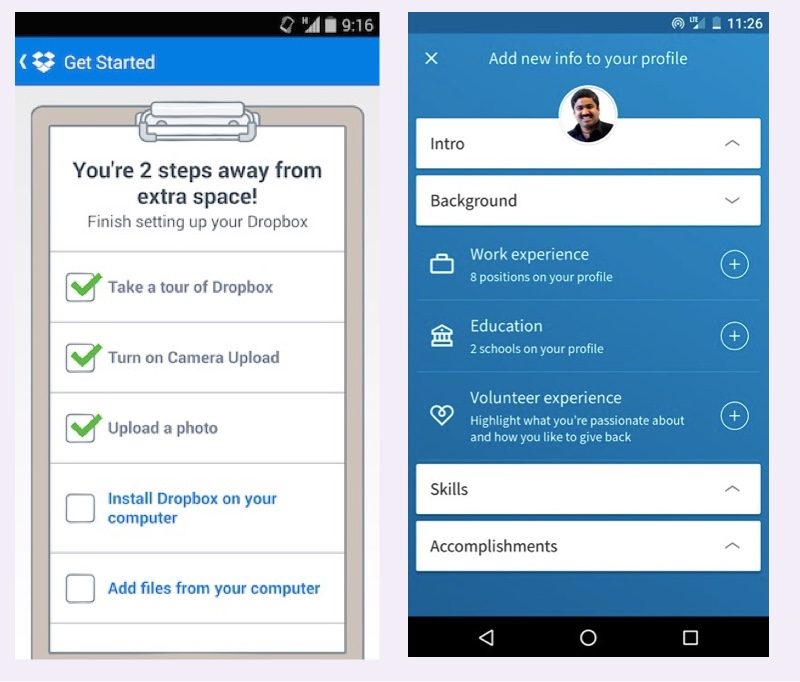
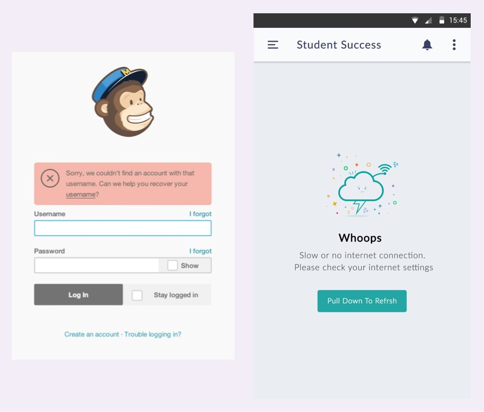

ในการสร้าง Website หรือ Application ขึ้นมาซักอันหนึ่ง, งาน Design เป็นสิ่งที่มีสำคัญมาก ๆ เนื่องจาก ความรู้ ความเข้าใจ และการจินตนาการ ของผู้ที่เกี่ยวข้องแต่ละคน ไม่ว่าจะเป็น CEO, Product Manager หรือ Developer นั้น มีไม่เท่ากัน

งาน Design จึงเป็นสิ่งที่ช่วยการันตีว่า ทุกคนที่เกี่ยวข้อง เห็นภาพเดียวกันอยู่ และนั่นก็เป็นหน้าที่ของพวกเรา Designer ครับ

ถ้า Design ออกมาไม่มีความชัดเจนพอ ก็จะทำให้เกิดความเข้าใจไม่ตรงกัน แม้ในรายละเอียดที่เล็กน้อย ก็อาจนำมาซึ่งการแก้ไข จนกระทบ Quality โดยรวมได้

> “Design is Communication”

การออกแบบ UI ที่ดีนั้น มีเรื่องที่ต้องคำนึงถึง อยู่หลายอย่าง ไม่ใช่เพียงแต่ออกแบบให้สวยเพียงงามอย่างเดียว ซึ่งหนึ่งในเรื่องที่สำคัญอันดับต้น ๆ ที่เราจะมาพูดถึงในวันนี้คือ **UI Stack** ครับ

## UI Stack

โดยทั่วไป Designer อย่างเรา ๆ มักจะออกแบบ UI ของแต่ละหน้า มาในลักษณะที่เป็น Ideal หรือแบบที่ดูสวยที่สุด มีข้อมูลเต็ม ปุ่มมาครบ ซึ่งพอเอาวางมาเป็น Screenflow ก็ดูสวยเป๊ะสุด ๆ แล้วก็มักจะจบแค่นั้น

แต่เมื่อ Developer เอาไปทำออกมาเป็น Website จริงแล้วนั้น...

**Designer:** “ทำไมเข้าหน้ามาแล้วมันนิ่ง ๆ อ่ะ พังป่ะเนี่ย ?”  
**Developer:** “มันกำลังโหลดข้อมูลสินค้าอยู่อ่ะ...”  
**Designer:** 🤦 “โอเค.. เดี๋ยวพี่ออกแบบ Spinner ให้ เอาไปใส่ตรงกลาง ๆ ระหว่างโหลดแล้วกัน”

‍**Designer:** “ทำไมหน้าหมวดหมู่นี้ เข้ามาแล้วนิ่ง ไม่แสดงอะไรเลย พังป่ะเนี่ย ?”  
**Developer:** “หมวดหมู่นี้ยังไม่มี User ลงสินค้าอ่ะ...”  
**Designer:** 🤦 “โอเค.. เพิ่มรูปกับข้อความ ตรงนี้หน่อย เดี๋ยวพี่ส่งรูปให้”

**Designer:** “ทำไมหน้าข้อมูลสินค้า ไม่โชวข้อมูล X ล่ะ Layout พังเลย”  
**Developer:** “คนขายยังไม่ได้ใส่ ข้อมูล X อ่ะ...”  
**Designer:** 🤦 “โอเค... เดี๋ยวพี่ออกแบบให้ใหม่นะ”

แก้ไขกันไปมา ก็อาจจะเริ่มเกิด Bug อื่น ๆ ตามมากอีก

ในชีวิตจริงการที่เราเปิดประตู แน่นอนว่ามันไม่ได้มีแค่ State “เปิด” กับ “ปิด” แต่มี State ที่เป็น Motion ระหว่างที่เราดันประตูโค้งออกไปตามเส้นทางของมัน จาก เปิด ไปสู่ ปิด มันถึงจะดูเป็นธรรมชาติ

ในงานออกแบบ UI ก็เช่นกัน บางหน้าไม่ได้มีเพียงแค่ State เดียว แต่ยังมี State อื่น ๆ ใน Flow ของมันอีก เราเรียก State ต่าง ๆ ของ UI ว่า UI Stack ซึ่งมีดังต่อไปนี้

- Ideal state
- Partial state
- Error state
- Loading state
- Empty state

	<picture class="_mgt-32px">
		<source srcset="stack@2x.webp 2x, stack.webp" type="image/webp">
		<source srcset="stack@2x.png 2x, stack.png" type="image/png">
		
		<em>UI Stack</em>
	</picture>

## Ideal state

Ideal state เป็น State ของ UI ที่ Desiger เราน่าจะคุ้นเคยที่สุด เพราะเป็นสิ่ง ที่มักจะถูกออกแบบขึ้นมา เป็นอันดับแรก เป็นสิ่งที่เราต้องการนำเสนอให้ User เห็นมากที่สุด ทั้งในด้านประโยชน์การใช้งาน และความสวยงาม

ซิึ่ง State อื่น ๆ ที่เราออกแบบตามมาภายหลัง ท้ายที่สุดแล้ว ก็เพื่อที่จะนำมาสู่ Ideal State นี่แหละครับ

การเริ่มที่ Ideal state ทำให้เราเห็นภาพได้ง่าย ว่าหน้านี้ ควรมี State ใด ๆ อีกบ้าง

ตัวอย่างของ Ideal state

- หน้า Inbox ของ Gmail ที่มี Email อยู่เต็มหน้า
- หน้า New feed ของ Facebook ที่แสดง Feed ต่าง ๆ ที่น่าสนใจ
- หน้า Landing page ที่โหลดข้อมูลมาครบแล้ว

	<picture class="_mgt-32px">
		<source srcset="ideal@2x.webp 2x, ideal.webp" type="image/webp">
		<source srcset="ideal@2x.jpg 2x, ideal.jpg" type="image/jpeg">
		
		<em>ตัวอย่าง Ideal state ของ Gmail (ซ้าย), หน้ารายการที่พัก ใน airbnb (ขวา)</em>
	</picture>

## Empty State

*ถ้ายังไม่มี Content จะแสดงผลอย่างไร ?*

Empty state เป็นเหมือนจุดเริ่มต้นของหน้านั้น ๆ ก็ว่าได้ เพราะในตอนที่เรา เปิดใช้งาน Website หรือ Application ครั้งแรก หรือครั้งใด ก็ตาม อาจจะยังไม่มีข้อมูลใด ๆ แสดงให้ User เห็นก็ได้ เช่น

- หน้า Inbox ที่ยังว่างเปล่า
- หน้าตระกร้าสินค้า ที่ยังไม่มีสินค้า
- หน้า Dashboard ที่ยังว่างเปล่า

Empty state ที่ดี ไม่ควรทำให้ User รู้สึกว่ามีบางอย่างพัง หรือหาทางไปต่อไม่ถูก

แทนที่เราจะแสดงเป็นหน้าต่างว่าง ๆ เราอาจจะใส่ “ทางไปต่อ” ให้ User ก็ได้

ตัวอย่างเช่น

- หน้า My News ของ BBC New Application จะมีช่องทางการสร้าง News Feed ของ User กรณีที่ไม่มีข้อมูลแสดง
- หน้า Search ของ Google Flights กรณีที่ Filter มาก จนไม่มีผลลัพธ์แสดง จะมีปุ่มให้ User ทำการล้าง Filter ออกทั้งหมด

	<picture class="_mgt-32px">
		<source srcset="empty@2x.webp 2x, empty.webp" type="image/webp">
		<source srcset="empty@2x.jpg 2x, empty.jpg" type="image/jpeg">
		
		<em>ตัวอย่าง Empty state ของ BBC New (ซ้าย), Google Flights (ขวา)</em>
	</picture>

ผู้อ่าน สามารถหาไอเดียการทำ Empty State เจ๋ง ๆ ได้เพิ่มเติมที่ <a href="http://emptystat.es/" target="_blank" class="bio-link -fancy" rel="noopener">emptystat.es</a> ครับ

## Loading State

ในโลกแห่งความเป็นจริง ข้อมูลที่เราจะใช้แสดงผล ใช้เวลาในการโหลด และระหว่างที่โหลดอยู่นั้น เราก็ควรมี Visual Cue อะไรบางอย่าง เพื่อบอก User ว่า หน้านี้ กำลังโหลด หรือทำงานอยู่

ตัวอย่างเช่น ระหว่างที่โหลด เราอาจจะใส่ Loading Animation เพื่อบอกให้ User รู้ว่าหน้านี้กำลังทำงานอยู่ หรือใช้ Skeleton screen เป็นหน้าโหลด เพื่อให้ User รู้สึกว่า Content ใกล้จะมาแล้ว รออีกไม่นาน เป็นต้น

	<picture class="_mgt-32px">
		<source srcset="loading@2x.webp 2x, loading.webp" type="image/webp">
		<source srcset="loading@2x.jpg 2x, loading.jpg" type="image/jpeg">
		
		<em>ตัวอย่าง Loading state ของ Agoda ที่ใช้ Logo Animation (ซ้าย), Facebook ที่ใช้ Skeleton scree (ขวา)</em>
	</picture>

## Partial State

ในบางหน้าจอ เราอาจจำเป็นต้องแสดงผล ในขณะที่ข้อมูลยังไม่ครบสมบูรณ์ ในแบบที่เราต้องการ, Patial State เป็นการทำให้หน้าแบบนั้นมีความหมาย และเป็นกระโยชน์กับ User

หน้าที่ยกตัวอย่างได้ชัด คือหน้า Profile ที่ User ยังใส่ข้อมูลไม่ครบ เป็นต้น

เราสามารถออกแบบ Patial State ให้ User รู้สึกถึง Benefit และอยากกรอกข้อมูลมากขึ้น หรือ ใส่การช่วยเหลือ นำทาง ให้ User กรอกข้อมูลง่ายขึ้นก็ได้

ตัวอย่างเช่น

- Dropbox บอก User ว่า ถ้าทำอีกสองขั้นตอน User จะได้ Benefit เป็น Extra space พร้อมทั้ง แสดง Checklist สิ่งที่สำเร็จแล้ว และสิ่งที่เหลือ เพื่อให้ User รู้สึกว่าทำมาบ้างแล้ว และอีกนิดเดียว ก็จะสำเร็จแล้ว
- Linkedin แสดงหน้าโปรไฟล์ พร้อมทั้ง Guide ในการใส่ข้อมูลที่เหลือให้ง่ายขึ้น

	<picture class="_mgt-32px">
		<source srcset="partial@2x.webp 2x, partial.webp" type="image/webp">
		<source srcset="partial@2x.jpg 2x, partial.jpg" type="image/jpeg">
		
		<em>ตัวอย่าง Partial state ของ Dropbox ที่แสดง Benefit (ซ้าย), Linkedin ที่มีข้อมูลช่วยในการใส่ข้อมูล (ขวา)</em>
	</picture>

## Error State

แต่ละหน้าจอ มีโอกาศเกิดข้อผิดพลาดได้ต่าง ๆ กัน แต่เมื่อมีความผิดพลาดเกิดขึ้น เราควรจะแสดงข้อมูล ที่เป็นประโยชน์ต่อ User หรือช่องทางไปสู่การแก้ปัญหา เพื่อไม่ให้ User ติดอยู่ที่หน้านี้ และหงุดหงิด จนออกจากเว็บของเราไป

ตัวอย่างปัญหาที่เกิดขึ้นเช่น

- Network มีปัญหา
- User ยังไม่ให้ Permission ที่จำเป็น
- ระบบ Server มีปัญหา ส่งข้อมูลมาไม่ได้
- User กรอกข้อมูลผิด
- กำลังออกจากหน้าจอไป โดยที่ยังมี Input ค้างอยู่

Error state ควรทำออกมาให้มีความเป็นมนุษย์ หรืออาจจะสอดแทรกความขี้เล่น เข้าไปนิดหน่อยก็ได้ เพื่อไม่ให้ User เห็นแล้วเกิดความกังวลจาก Technical Term ที่แสดงบนหน้าจอ

> Bad request..., Internal Server Error... 0xE213AE What!??

	<picture class="_mgt-32px">
		<source srcset="error@2x.webp 2x, error.webp" type="image/webp">
		<source srcset="error@2x.jpg 2x, error.jpg" type="image/jpeg">
		
		<em>ตัวอย่าง Error state ของ mailchimp ที่แสดง ที่แสดงข้อความช่วยเหลือ (ซ้าย), Error เมื่อไม่สามารถเชื่อมต่อ Internet ได้ และแสดงคำแนะนำ (ขวา)</em>
	</picture>

## ก่อนจากกัน

การออกแบบหน้าจอโดยคำนึงถึง State ต่าง ๆ ช่วยให้เรานำ User ไปสู่หน้าจอ Ideal โดยที่ User ไม่รู้สึกติดขัด และยังช่วยให้ Developer ทำงานง่ายขึ้นอีกด้วย

แต่ไม่ได้หมายความว่าเราต้องออกแบบหน้าจอใด ๆ ให้ครบทั้ง 5 State นะครับ บางหน้าจอก็อาจจะมีเพียงแค่ 2 หรือ 3 State ก็ได้ครับ

สิ่งที่อยากจะบอกคือ เราควรคิดออกแบบ โดยคำนึงถึงการใช้งานจริง ไม่ปล่อยให้ User รู้สึกถึงอาการติดขัด และ User จะขอบคุณเรา ที่ช่วยเขาออกจาก State ที่เขาติดปัญหาครับ

สุดท้ายนี้

> Don't Give Your Users Shit Work. – Zach Holman  

และอย่าลืม

> Don't Give Your Usersself Shit Work. – Benjamin Wilkins

สวัสดีครับ

---